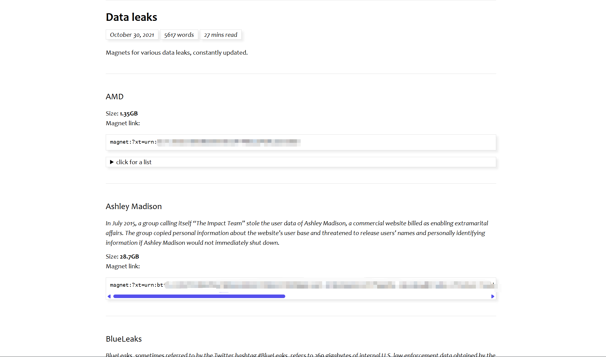
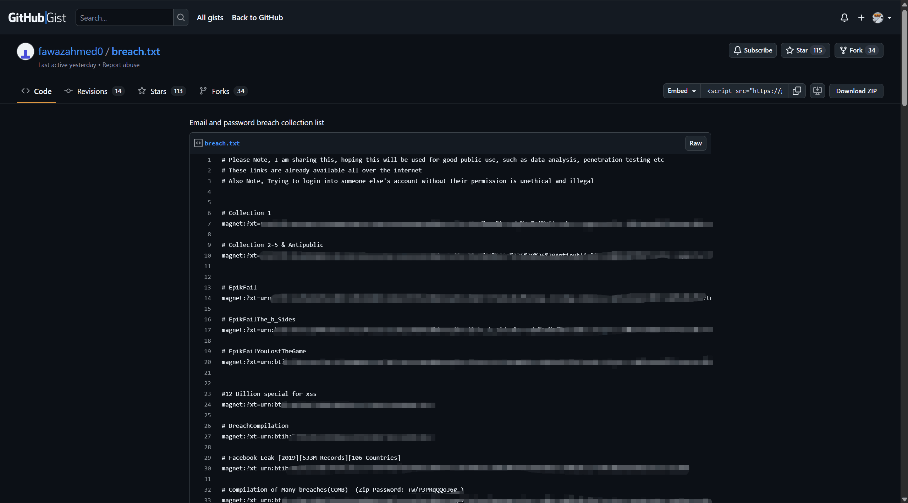

本项目是 **StarCrossedLovers** 战队在 DataCon2025 口令安全赛道中的完整技术解决方案。

我们综合运用了多种密码猜测技术，构建了一套覆盖离线分析和在线攻击场景的攻击框架，最终获得二等奖。

<!--more-->

Github : https://github.com/GyroJibering/DataCon2025-StarCrossedLovers

**最终成绩：42.8 (加权分)**

- **离线猜测得分：67.5**
- **在线猜测得分：39.5**


## 项目概览

本项目旨在应对现代密码安全挑战，通过模拟真实世界中的密码猜测攻击，探索和实践最高效的密码破解策略。

我们从 **离线哈希破解** 和 **在线定向猜测** 两个维度展开攻击，涵盖了从传统统计模型到最先进的大语言模型（LLM）的多种方法。对密码生成模式、用户行为习惯以及如何利用个人可识别信息（PII）进行精准攻击进行深度研究。

- 数据驱动策略：系统性搜集、清洗、整理多个公开数据集，提供数据基础。
- 结合了基于字典、规则的传统攻击与基于机器学习和大语言模型的现代攻击手段。
- 使用 PII 驱动的定向攻击：利用用户个人信息，通过多种模型实现高精度的在线密码猜测。
- 模型融合与优化：对不同模型生成的候选密码进行强度评分和筛选，实现结果的融合与提纯，有效提升了最终命中率。


## 技术方法与实现

我们的攻击策略分为两个主要阶段：离线猜测（广度优先的拖网攻击）和在线猜测（深度优先的定向攻击）。

### 离线猜测

离线猜测的目标是在拥有哈希数据集的情况下，尽可能多地破解密码。

#### 1. 基于PCFG和马尔可夫链的口令预测方法

首先应用了 概率上下文无关文法（PCFG）和马尔可夫模型。通过对公开密码数据集进行训练，模型学习了密码的结构和字符转移概率，并生成了候选密码列表。

> 该方法在初期验证了统计模型的可行性，但覆盖率有限。


#### 2. 大规模字典与规则攻击

使用 `John the Ripper`  `Hashcat` 开源工具，利用 `rockyou.txt` 等大型字典，并结合 `John` 的 `All` 规则集进行暴力破解。通过 GPU 加速，该方法能够快速覆盖大量由简单词根和通用变换构成的密码。

```shell
# 使用 John the Ripper 配合 rockyou 字典和所有规则集
.\john.exe --wordlist=rockyou.txt --format=raw-sha256 --rules=All offline_dataset.txt
```

> 分析破解结果发现，相当一部分密码的特殊字符集中在末尾，这为后续规则优化提供了思路。


#### 3. AI 驱动和候选集生成

为突破传统字典的局限性，我们引入了 `RFGuess`、`PassBert` 和 `PassLLM` 等AI模型生成拖网数据。这些模型能捕捉更复杂的密码模式，生成更具针对性的候选集，帮助我们额外破解了百余条高难度密码。


#### 4.自动化彩虹表检索

我们利用爬虫技术自动化地查询了多个公开的在线彩虹表服务。

通过编写脚本批量提交哈希值，我们成功利用庞大的预计算数据库破解了一部分无法通过上述方法解决的哈希。这是一种高效的补充手段。


### 在线猜测

在线猜测针对给定的用户信息（PII），为每个目标生成一个高度定制化的密码候选列表。
> `PII` : Personal Identifiable Information


#### 1. 基于规则的 PII 组合攻击

1) 编写 Python 脚本，提取用户的各项PII（姓名、生日、账户名等），并根据常见密码模式进行组合、变形（如添加常见前后缀、年份、特殊字符）。

2) 利用 `Hashcat` 的规则引擎和精选的规则集（如 `Unicorn3k.rule`）对单个 PII 进行深度变换，极大地扩展了猜测空间。

> `Hashcat` 的原生规则难以处理多 PII 的组合。我们通过自定义脚本先对 PII 进行组合（如 `name` + `birth`），再将组合结果作为基础词输入 `Hashcat` 进行规则变换。


#### 2.TarGuess-I：语义增强的PCFG模型

 https://github.com/CSSLabNKU/TarGuess-I

TarGuess-I 是将语义信息引入 PCFG 算法，将原有的 LDS 拓展为 **NBAEPI** (name, birth, accout name, email, phone number, id card)，能够精确语义匹配，可扩展，并且能根据训练集自动忽略没有的标签。而目标用户正好是 **NBAEP** 这五项 pii，适配在线场景。

我们首先使用官方预训练模型（基于 12306 数据集）进行测试，取得了 23 分。为适应本次比赛的国外场景，我们使用自行收集和清洗的、包含多项 PII 的数据集对其进行**重新训练**，最终将得分提升至 **35.2**。


#### 3.PassBert：基于Transformer的猜测框架

https://github.com/snow0011/PassBertStrengthMeter

PassBert：基于双向Transformer的猜测框架，将pre-training应用于密码猜测攻击。利用 Transformer 强大的序列建模能力，在条件密码猜测和自适应规则生成方面表现出色，并且有一个强度计，能预测生成口令的概率。

我们结合其 **针对性猜测** 和 **自适应规则** 两种模式。对于给定的 PII，模型可以基于其与已知泄露密码的编辑距离，或为其智能选择最优的变换规则，最终得分 16.5。

> 得分较低，一方面是因为训练成本较高，没有重新训练，使用了官方预训练模型，其训练数据与目标场景存在偏差；另一方面是 训练数据集中很多密码仅仅是重名，模型针对性猜测基于泄漏密码的编辑距离不是很优秀。在强度计前排的数据多半为规则密码猜测。


#### 4.PassLLM：利用LLM进行密码生成

https://zenodo.org/records/15612295

引入 LoRA 对大语言模型进行微调，使其能够理解并生成符合特定模式的密码。支持 trawling 和 targeted 场景。

我们使用 `12306` 和清洗后的英文数据集进行混合训练，以避免模型在特定语言场景下过拟合。通过微调，LLM 学会了 PII 与密码之间的复杂映射关系，生成了大量高质量的候选密码。

推理脚本： `generate_password_guesses.py`


### 结果融合与精炼

为了在提交限制（10,000条/用户）内最大化命中率，我们设计了最后一步的融合策略。

1. 汇总所有模型生成的密码候选列表，并使用基于 `zxcvbn` 的密码强度评估脚本进行打分。

2. 过滤掉强度过高（过于随机，不符合人类习惯）的密码。

3. 根据各个模型历史表现的得分进行加权排序，最终为每个用户筛选出最优的10000条猜测。

该策略有效去除了低质量猜测，使最终得分从 35.2 提升至 **39.5**。


## 数据集策略

口令预测是数据驱动的问题，高质量的数据是预测成功的关键。以下是我们的数据策略。

### 1.数据源

- 赛题论文指向的公开数据集
- 通过搜索引擎 Hacking、安全论坛和公开代码库（如 GitHub Gist）搜集的历史泄露事件数据。

经阅读整理后，总结出我们预测工作所用的主要数据集列表，整理到 `Online/Data Cleansing` 中。


### 2.筛选标准

针对在线场景赛题目标：

```
email name account phone birth -> password
```

我们定义的优质数据集的标准是：

- **强PII关联性**：密码与用户的PII（姓名、邮箱、账户、电话、生日）有明显关联。
- **信息完整性**：包含尽可能多的PII字段。
- **明文密码**：密码为明文或易于解密，便于分析模式。

根据这样的要求，开启数据集搜索工作


### 3.数据收集

有关数据搜集工作的具体展开方式，首先作出以下几点声明/注意：

1. 我们搜集的数据集均为在历史数据泄露事件中的公开开源的数据集；
2. 我们搜集数据集均采用的是**合法合规**的手段，**并未有任何违反中华人民共和国法律的行为**；
3. 我们搜集到的数据集**仅用于实验研究**，并未在此之外产生以任何形式为载体的传播，未造成二次泄露；
4. 为保护泄露数据集中的受害者隐私，在对数据集进行说明时，不会给出数据集的完整内容、来源（包括网站、磁力链接、网盘或BT种子等任何形式），仅会在必要时取部分截图或文字说明进行证明。

#### 数据收集具体展开方式

- 搜索引擎直接搜索：使用谷歌、百度、DuckDuckGo 以及 Ahmia.fi 搜索以下关键词，了解数据集泄露情况。

	````
	[Name of Dataset] | Leakage | Data Breach | Dataset
	````

- 谷歌 hack 语法搜索： 获取泄露数据集磁力链接。

	```
	"<Name of Dataset> data leak" "magnet:?"
	```

- 论坛和网站搜索：在知名论坛 Reddit 以及 Github 上提供了泄露数据集有效线索，并提示了一些专业搜集泄露数据集的网站。


#### 收集结果

1. 一个github上某用户整理的众多数据集链接，挂载到了他的个人Github Gist上，截图如下：
	

	其中包含Collection 1、Collection 2-5 & Antipublic、EpikFail、Compilation of Many breaches(COMB)、Leaked Database Archive.7z 等众多泄露数据集整合包，单个整合包中均包含大量数据集。
	其中，我们进一步选用了 `Leaked Database Archive.7z` 以及 `Collection#3` 进行下载研究，里面包含的数据集名单见`list1.txt`

2. 一个专业搜集泄露数据集的网站

	

	该网站包含了大量由专业黑客群体或个人整理的数据集整合包，从中我们筛选出两份整合包，分别是`list2.txt`和`list3.txt`，详细信息我们不做过多说明


### 4.数据集清洗

经过 AI 辅助初筛和人工精选，我们重点使用了一批来自社交、交友和娱乐网站的泄露数据，因为这类数据通常具有更全面的信息、更强的 PII-密码关联性，并且是明文密码。

最终得到有效的优质数据集（文件名或数据集名称）如下：

```
1. 36k_member.csv
2. fling.com_40M_users.sql
3. www.naijaloaded.com_Database - INTRAOPS.sql
4. YouPorn.txt
5. mate1.com-plain-november-2015.txt
6. waydate_dump.csv
```

然后，需要对这些原始文件进行进一步处理，处理为模型训练可用的数据集格式，比如 csv/json 格式


## 技术栈

密码破解工具: `John the Ripper`, `Hashcat`

机器学习/深度学习: `Python`, `PyTorch` (PassLLM/PassBert) ,`Pandas`

模型框架:  `PassBert`, `PassLLM`, `TarGuess-I`

密码强度评估:  `zxcvbn`


## 最终成果与反思

加权得分: 42.8，最终获得了全国二等奖。

从本次竞赛带给我们一些启示:

- 混合策略：没有任何单一模型能解决所有问题。传统规则与现代模型的结合才能实现覆盖率和准确率的最大化。

- 数据质量：针对特定场景（如国外用户），使用匹配的数据集进行模型训练至关重要。

- 后处理价值：对模型输出进行智能筛选和融合，能以较小成本显著提升破解率。
