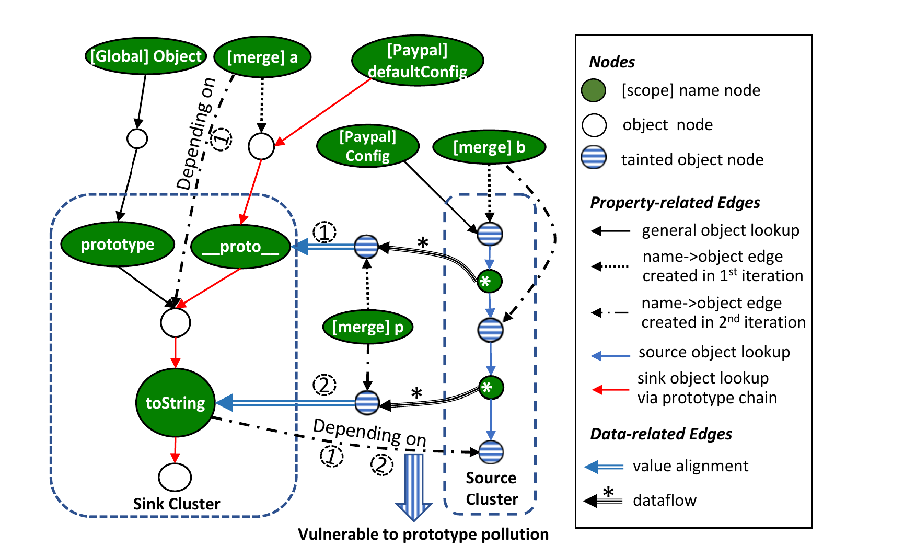
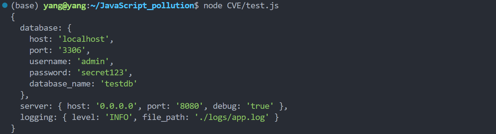
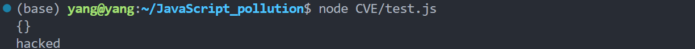
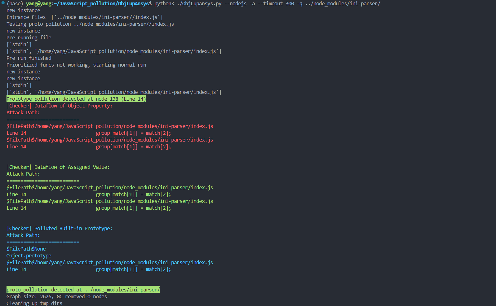

JavaScript 是一种非常灵活的动态语言，核心机制之一就是原型链继承，但也引入了原型链污染漏洞。即攻击者通过原型链修改父类（上到 Object 类）的属性，影响父类或所有对象行为。

<!--more-->

## 论文笔记

**Detecting Node.js Prototype Pollution Vulnerabilities via Object Lookup Analysis (2021)**

使用 AST 静态分析 JavaScript，难以精确地建模原型链继承和动态属性访问等行为，为了解决这个问题，论文提出一种 **Object Property Graph（OPG）**，新增 对象节点 和  属性/变量节点。（`object node`、`name node`）。

在 OPG 的基础上分析污点传播，将 Source 和 Sink 同时扩展，如果出现汇点，说明可能存在一条从输入到敏感属性的污染路径，之后约束求解验证。

```javascript
// JS 原型链污染示例
function merge(a,b){
    for(var p in b){
        try{
            if(b[p].constructor === Object){
                a[p] = merge(a[p],b[p]);
            } else{
                a[p] = b[p];
            }
        } catch(e){
            a[p] = b[p];
        }
    }
    return a;
}
// ......
var Paypal = function(config){
    if(!config.userId)
        throw new Error('Config must have userId');
    if(!config.password)
        throw new Error('Config must have password');
    // ......
    this.config = merge(defaultConfig,config);
};
// ......
module.exports = Paypal;
```

这份示例代码：`merge` 函数递归合并 `b` 到 `a`，但是没过滤 `__proto__` 、 `prototype`、 `constructor ` 这三个键。

调用：`merge(defaultConfig,config)` ，其中 `config` 用户可控，则可以通过这些键访问修改 `defaultConfig` 的原型对象。

PoC

```javascript
var PayPal = require ('paypal-adaptive');
var p = new PayPal(JSON.parse('{"__proto__":{"toString":"polluted"},"userId":"foo""password":"bar","signature":"abcd","appId":"1234","sandbox":"1234"}'))
console.log(({}).toString);
```

> 输出：polluted

### 1.OPG 对象属性图



新增 **属性节点** 和 **变量节点**

左边是 Sink ，右边是 Source，中间的 蓝色箭头 赋值边，表示可控输入从 Source Cluster 赋值污染到 Sink Cluster

`*` 通配符节点表示用户可控的任何输入。

图中 ① 表示 第一轮递归 p 赋值 为 `__proto__` 

图中 ② 表示 第二轮递归 p 赋值为 `toString`

第三轮递归完成对这个`toString` 赋值  `toString = b['__proto__']['toString']` 。

通过 OPG，能够清晰地描绘出数据如何在不同对象和它们的属性之间流动，所以这个图具备精确分析 JS 继承行为的基础。


### 2.Object Lookup Analysis 对象查找分析 

#### Source Cluster Expansion

初始化受攻击者控制的数据源的集合，并通过数据流分析扩展。

污点源一般来源于用户输入， 输入内容可能是任何对象，标记为被污染的对象。

这个对象的赋值、传参、属性访问的结果都受攻击者控制，相关对象节点都视为被污染，相关属性（name node）使用通配符 `*` 表示。


#### Sink Cluster Expansion

初始化被污染的目标集合为敏感函数集合，同样进行扩展。

具体来说，Sink 集合初始化为 JavaScript 内置函数的原型（ `Object.prototype`等）。

当分析过程中遇到对敏感属性的访问操作时，将访问敏感属性的这条原型链上的节点也纳入 Sink 集合。因为攻击者可能通过修改节点访问到敏感属性。


#### Constraint Collection and Solving

上述 Source 和 Sink 集合扩展的过程中，会记录污染条件，然后尝试将 Source 中通配符节点 与 Sink 中原型链节点对齐。

然后判断所有的对齐条件是否能同时成立。

如上图将 第一轮递归的 p 与   `__proto__`  对齐，第二轮递归的 p 与  `toString` 对齐。左边的 Sink 和右边的 Source 是独立的，所以这个场景下对齐条件显然能够成立。


## ObjLupAnsys 源码分析

<!--Talk is cheap. Show me the code-->

项目源码：https://github.com/Song-Li/ObjLupAnsys.git

> 代码量很大，我仅挑选一些比较关键的部分进行分析

### 1.OPG 的构建

首先使用 `Esprima` (https://esprima.org/)  解析 JavaScript 生成 AST

基于 AST 构建 OPG：深度优先遍历 AST，每个节点调用对应 Handler，负责将 AST 节点转换成 OPG 中的对应结构。

```python
def __init__(self, G):
    self.G = G
    self.handler_map = {
            'File': self.HandleFile,
            'Directory': self.HandleFile,
            'AST_TOPLEVEL': self.HandleToplevel,
            'AST_ASSIGN': self.HandleAssign,
            'AST_CALL': self.HandleASTCall,
            'AST_METHOD_CALL': self.HandleASTCall,
            'AST_METHOD': self.HandleMethod,
            'AST_NEW': self.HandleASTCall,
            'AST_NAME': self.HandleVar,
            'AST_VAR': self.HandleVar,
            'AST_PROP': self.HandleProp,
            'AST_DIM': self.HandleProp,
            'AST_CONST': self.HandleVar,
            'integer': self.HandleConst,
            'string': self.HandleConst,
            'double': self.HandleConst,
            'AST_FUNC_DECL': self.HandleFuncDecl,
            'AST_CLOSURE': self.HandleFuncDecl,
            'AST_ARRAY': self.HandleArray,
            'AST_ARRAY_ELEM': self.HandleArrayElem,
            'AST_UNARY_OP': self.HandleUnaryOp,
            'AST_FOR': self.HandleFor,
            'AST_WHILE': self.HandleWhile,
            'AST_FOREACH': self.HandleForEach,
            'AST_BREAK': self.HandleBreak,
            'AST_EXPR_LIST': self.HandleExprList,
            'AST_PRE_INC': self.HandleIncDec,
            'AST_POST_INC': self.HandleIncDec,
            'AST_PRE_DEC': self.HandleIncDec,
            'AST_POST_DEC': self.HandleIncDec,
            'AST_IF': self.HandleIf,
            'AST_IF_ELEM': self.HandleIfElem,
            'AST_CONDITIONAL': self.HandleConditional,
            'AST_BINARY_OP': self.HandleBinaryOP,
            'AST_SWITCH': self.HandleSwitch,
            'AST_SWITCH_LIST': self.HandleSwitchList,
            'AST_RETURN': self.HandleReturn,
            'AST_TRY': self.HandleTry,
            'NULL': self.HandleNULL,
            'AST_THROW': self.HandleThrow,
            'AST_CATCH_LIST': self.HandleCatchList,
            'AST_CONTINUE': self.HandleContinue,
            'AST_STMT_LIST': self.HandleStmtList,
            'AST_ASSIGN_OP': self.HandleAssignOP,
            'AST_ENCAPS_LIST': self.HandleEncapsList,
            'AST_CLASS': self.HandleClass,
            }
```

下面是源码中的 Handler 类，是所有 handler 的父类，在每个 handler 中，会调用 重写的 process 函数

```python
class Handler(object):
    """
    this is the parent class for all the handlers, including a 
    process method, a post_successors method.
    """
    def __init__(self, G: Graph, node_id: str, extra=None):
        from src.plugins.manager_instance import internal_manager as internal_manager
        self.internal_manager = internal_manager
        self.G = G
        self.node_id = node_id
        self.extra = extra

    def process(self):
        """
        for each handler, we should have a pre processing 
        method, which will actually run the node handle process.
        If the handling process can be finished in one function,
        we do not need further functions
        """
        print("Unimplemented Process Function")
        pass
```

这些 handler 在 `src/plugins/internal`  中，我选择 `src/plugins/internal/array.py` 为例，

```python
class HandleArray(Handler)       # 处理数组
# ......

class HandleArrayElem(Handler):  # 处理数组中每个元素
    def process(self):
        if not (self.extra and self.extra.parent_obj is not None):
            loggers.main_logger.error("AST_ARRAY_ELEM occurs outside AST_ARRAY")
            return None
        else:
            try:
                # 获取 key 和 value 的 AST 节点
                value_node, key_node = self.G.get_ordered_ast_child_nodes(self.node_id)
            except:
                return NodeHandleResult()
            key = self.G.get_name_from_child(key_node) 
            
            # 对键和值进行一些处理
            if key is not None:
                key = key.strip("'\"")
            else:
                key = self.G.get_node_attr(self.node_id).get('childnum:int') 
            if key is None:
                key = wildcard 
            handled_value = self.internal_manager.dispatch_node(value_node, self.extra)
            value_objs = to_obj_nodes(self.G, handled_value, self.node_id)
            
            # 建立属性关系
            for obj in value_objs:
                self.G.add_obj_as_prop(
                    key,                               # 属性名
                    self.node_id,                      # AST节点
                    parent_obj=self.extra.parent_obj,  # HandleArray 创建的对象节点 
                    tobe_added_obj=obj                 # 值对象
                )
        return NodeHandleResult(obj_nodes=value_objs,
            callback=get_df_callback(self.G))

    
class HandleUnaryOp(Handler)       # 处理一元操作
# ......
```

`HandleArray` 处理数组，在其中调用 `HandleArrayElem` 处理数组每个元素，建立 `array[key] -> value` 关系


不同类型的 AST 节点采取不同的策略，构造相应的 OPG（**分支敏感**）

在 DFS 遍历完 AST 之后，OPG 就构建成功。 


### 2.Source and Sink Cluster Expansion

Sink 初始化：定义初始 Sink 集合，为 JavaScript 内置对象的原型。 

```python
# src/plugins/internal/setup_env.py
# ......
    G.builtin_prototypes = [
        G.object_prototype, G.string_prototype,
        G.array_prototype, G.function_prototype,
        G.number_prototype, G.boolean_prototype, G.regexp_prototype
    ]
    # 将内置属性视为 Sink 
    G.pollutable_objs = set(chain(*
        [G.get_prop_obj_nodes(p) for p in G.builtin_prototypes]))
    G.pollutable_name_nodes = set(chain(*
        [G.get_prop_name_nodes(p) for p in G.builtin_prototypes]))
```

此外还启发式定义了一些函数列表，其中有标记为 sink 的方法

```python
# src\core\vul_func_lists.py
signature_lists = {
        'os_command': [
            'eval',
            "sink_hqbpillvul_execFile",
            'sink_hqbpillvul_exec',
            'sink_hqbpillvul_execSync',
            'sink_hqbpillvul_spawn',
            'sink_hqbpillvul_spawnSync',
            'sink_hqbpillvul_db'
            ],
        'xss': [
            'sink_hqbpillvul_http_write',
            'sink_hqbpillvul_http_setHeader'
            ],
        'proto_pollution': [
            'merge', 'extend', 'clone', 'parse'
            ],
        'code_exec': [
            'Function',
            'eval',
            "sink_hqbpillvul_execFile",
            'sink_hqbpillvul_exec',
            'sink_hqbpillvul_execSync',
            'sink_hqbpillvul_eval'
            ],
        'sanitation': [
            'parseInt'
            ],
        'path_traversal': [
            'pipe',
            'sink_hqbpillvul_http_write',
            'sink_hqbpillvul_http_sendFile',
            ],
        'depd': [
            'sink_hqbpillvul_pp',
            'sink_hqbpillvul_code_execution',
            'sink_hqbpillvul_exec'
            ]
}
```


**Source Cluster Expansion** 、**Sink Cluster Expansion**  在属性处理过程中动态进行

`handle_prop` 函数检查属性名的来源，如果来自污点，将相关节点标记被污染；

检查 `parent_obj` 是否属于 `builtin_prototypes`，直接识别对敏感原型的访问。如果检测到代码正在访问内置原型的属性，将此次访问标记为 Sink 

```python
# src/plugins/internal/handlers/property.py
def handle_prop(G, ast_node, side=None, extra=ExtraInfo()) \
    -> (NodeHandleResult, NodeHandleResult):
    # recursively handle both parts
	# ......
    # prepare property names
    prop_names, prop_name_sources, prop_name_tags = to_values(G, handled_prop, for_prop=True)
    
    # 判断属性名的来源中有污点，属性名也为污点
    name_tainted = False
    key_objs = handled_prop.obj_nodes 
    if G.check_proto_pollution or G.check_ipt:
        for source in chain(*prop_name_sources):
            if G.get_node_attr(source).get('tainted'):
                name_tainted = True
                break

	# 判断父对象是否是内置原型
    # 是内置原型 → 添加到 Sink
    parent_is_proto = False
    if G.check_proto_pollution or G.check_ipt:
        for obj in handled_parent.obj_nodes:
            if obj in G.builtin_prototypes:
                parent_is_proto = True
                break
# ......
```


污点传播：`add_contributes_to` ，当数据从一个节点流向另一个节点，比如赋值操作时，在 OPG 中添加 `CONTRIBUTES_TO` 数据流边，并将 `tainted`标记 从源节点传递到目标节点。

```python
def add_contributes_to(G: Graph, sources, target, operation: str=None,
    index: int=None, rnd: str=None, chain_tainted=True):
    # ...
    tainted = False
    for i, source in enumerate(sources):
        # ...
        G.add_edge(source, target, attr) # 添加数据流边
        # 检查源节点是否被污染
        tainted = tainted or G.get_node_attr(source).get('tainted', False)
    
    # 如果源被污染，则将污染传递给目标节点
    if chain_tainted and tainted:
        G.set_node_attr(target, ('tainted', True))
```


### **3.Object Lookup Analysis**

`find_prop` 进行对象查找分析，递归查找属性，模拟 JavaScript 的属性查找机制。

```python
# src/plugins/internal/handlers/property.py
def find_prop(G, parent_objs, prop_name, branches=None,
    side=None, parent_name='Unknown', in_proto=False, depth=0,
    prop_name_for_tags=None, ast_node=None, prop_name_sources=[]):

    if depth == 5: # 防止无限递归
        return [], [], None, None
    
    prop_name_nodes = set()  # 找到的属性名节点
    prop_obj_nodes = set()   # 找到的属性对象节点
    proto_is_tainted = False # 原型是否被污染的标志
    found_in_proto = False   # 是否在原型链中找到的标志

    for parent_obj in parent_objs:
		# ......
        # 1.直接属性查找
        prop_name_node = G.get_prop_name_node(prop_name, parent_obj)
        if prop_name_node is not None and prop_name != wildcard:
			# ......

        # 2. 如果直接属性未找到，在 __proto__ 链中搜索
        elif prop_name != '__proto__' and prop_name != wildcard:
			# ......

        # 3. 如果属性名是通配符，获取所有属性
        if not in_proto and prop_name == wildcard:
			# ......

        # 4. 如果找不到具体属性，模拟 JavaScript 创建一个属性节点
        if (not in_proto or G.check_ipt) and prop_name != wildcard and (
                not name_node_found or G.check_proto_pollution or G.check_ipt):
			# ......
        # ......
    
    # 只有当找到属性名节点时，才认为在原型中找到了属性
    found_in_proto = found_in_proto and len(prop_name_nodes) != 0
	# ......
    return prop_name_nodes, prop_obj_nodes, found_in_proto, proto_is_tainted
```

第二步 模拟原型链查找，获取未找到属性的 `__proto__` 并递归调用自身，实现原型链查找

第三步 处理通配符，处理用户输入的未知属性（ Source Cluster Expansion ）。

第四步 模拟 JavaScript 动态添加属性的行为。如果属性不存在，会在 OPG 中创建新的属性节点。

> 这个函数太长，对象查找机制实现比我贴出来的要多得多，我仅列出了关键流程。


### 4.Constraint Collection and Solving

当分析器检测到一个潜在的原型链污染时，需要收集从 Source到 Sink 的完整路径，并对其进行验证。


**路径回溯**：从检测到被污染的 Sink 开始，沿着数据流边反向追溯到 Source 。有两种回溯，一是 `traceback` 从漏洞点，沿着 `OBJ_REACHES`  回溯到污点源，二是 `obj_traceback` 基于对象级依赖，沿着`CONTRIBUTES_TO` 边进行回溯。

```python
def obj_traceback(G, start_node):
    text_path = ""
    ast_pathes = []
    # 沿着数据流边回溯
    obj_pathes = G._dfs_upper_by_edge_type(source=start_node, edge_type="CONTRIBUTES_TO")

    for obj_p in obj_pathes:
        obj_def = get_obj_defs(G, obj_p)
        ast_pathes.append(obj_def)
        text_path += get_path_text(G, obj_def)
    return obj_pathes, ast_pathes, text_path
```

```python
def traceback(G, vul_type, start_node=None):
    res_path = ""
    ret_pathes = []
    caller_list = []
    if vul_type == "proto_pollution":
        # 从漏洞触发点开始
        if start_node is not None:
            start_cpg = G.find_nearest_upper_CPG_node(start_node)
            # 沿 OBJ_REACHES 进行 DFS，反向追溯数据来源 
            pathes = G._dfs_upper_by_edge_type(start_cpg, "OBJ_REACHES")

            for path in pathes:
                ret_pathes.append(path)
                path.reverse()
                res_path += get_path_text(G, path, start_cpg)
            
            return ret_pathes, res_path, caller_list
    # ......
```


**约束验证**：收集到的路径需要经过验证，以排除误报。下面三个函数是验证过程的一个调用栈，`check` 函数作为最底层函数，执行具体约束验证，根据约束对路径进行检查。

```python
def vul_checking(G, pathes, vul_type):
    """漏洞路径验证"""
    proto_pollution = [
            [('has_user_input', None), ('not_exist_func', signature_lists['sanitation'])]
            ]
    vul_type_map = {
            "proto_pollution": proto_pollution,
            }
    rule_lists = vul_type_map[vul_type]
    success_pathes = []
    print('vul_checking', vul_type)

    for path in pathes:
        res_text_path = get_path_text(G, path, path[0])
        loggers.main_logger.info(res_text_path)
	# 对每组规则进行检查，实际上只有原型链污染一组规则
    for rule_list in rule_lists:
        success_pathes += do_vul_checking(G, rule_list, pathes)
    print_success_pathes(G, success_pathes)
    return success_pathes
```

可以看到 **原型链污染的约束规则** 是 必须有用户输入、不能有净化函数

然后调用 `do_vul_checking` 用该规则对路径进行检查，实际上传的规则组是

`[('has_user_input', None), ('not_exist_func', signature_lists['sanitation'])]`

这个净化函数列表仅定义为 `parseInt` ，在之前给的 `signature_lists` 中

```
'sanitation': ['parseInt']
```


```python
def do_vul_checking(G, rule_list, pathes):
    """执行具体的规则检查"""
    trace_rules = []
    for rule in rule_list:
        trace_rules.append(TraceRule(rule[0], rule[1], G))

    success_pathes = []
    flag = True
    for path in pathes:
        flag = True
        # 对规则组中每个规则进行检查，必须同时满足
        for trace_rule in trace_rules:
            if not trace_rule.check(path):
                flag = False
                break
        if flag:
            success_pathes.append(path)
    return success_pathes
```

调用 `check` 对规则组中每个规则进行检查，分别检查 `('has_user_input', None)`  和 `('not_exist_func', signature_lists['sanitation'])` 。

```python
def check(self, path):
    """
    select the checking function and run it based on the key value
    Return:
        the running result of the obj
    """
    key_map = {
            "exist_func": self.exist_func,
            "not_exist_func": self.not_exist_func,
            "start_with_func": self.start_with_func,
            "not_start_with_func": self.not_start_with_func,
            "start_within_file": self.start_within_file,
            "not_start_within_file": self.not_start_within_file,
            "end_with_func": self.end_with_func,
            "has_user_input": self.has_user_input,
            "start_with_var": self.start_with_var
            }

    if self.key in key_map:
        check_function = key_map[self.key]
    else:
        return False

    return check_function(self.value, path)
```

这里有一个映射表，处理不同规则，看`has_user_input` 的具体逻辑是：

```python
    def has_user_input(self, _, path):
        pre_node = None
        for node in path:
            if not pre_node:
                pre_node = node;
                continue
            
            cur_edges = self.graph.get_edge_attr(pre_node, node)

            if not cur_edges:
                continue
            for k in cur_edges:
                if 'type:TYPE' in cur_edges[k] and cur_edges[k]['type:TYPE'] == "OBJ_REACHES":
                    obj = cur_edges[k]['obj']
                    obj_attr = self.graph.get_node_attr(obj)
                    if 'tainted' in obj_attr and obj_attr['tainted']:
                        return True
            pre_node = node

        if self.start_within_file(['http.js', 'process.js', 'yargs.js'], path):
            return True
        return False
```

只有两种情况返回 `True`，一是 `OBJ_REACHES` 边上对象有 `tainted` 标记，说明确实有用户输入污染，另一个是启发式的通过文件名匹配，补充证明有用户输入。

> `http.js`：HTTP 请求处理
>
> `process.js`：命令行参数处理
>
> `yargs.js`：命令行解析库


总之，只有当一条污染路径满足预设的约束条件时，系统才会最终将其报告为一个真实可信的漏洞。


## CVE 分析

```
ini-parser		0.0.2		index.js(Line 14)		CVE-2020-7617
```

> [Prototype Pollution in ini-parser | CVE-2020-7617 | Snyk](https://security.snyk.io/vuln/SNYK-JS-INIPARSER-564122)

`ini-parser` 是一个解析 .ini 文件的包

```shell
npm i ini-parser@0.0.2
```


正常使用

```ini
[database]
host = localhost
port = 3306
username = admin
password = secret123
database_name = testdb

[server]
host = 0.0.0.0
port = 8080
debug = true

[logging]
level = INFO
file_path = ./logs/app.log
```

```javascript
var parser = require('ini-parser');
console.log(parser.parseFileSync('./CVE/test.ini'))
```




### PoC

```ini
[__proto__]
toString=hacked
```

```javascript
var parser = require('ini-parser');
console.log(parser.parseFileSync('./CVE/test.ini'))
// 检查一下是否成功污染 Object
console.log({}.toString);
```




### 源码分析

`index.js` ：

```javascript
// const fs = require('fs');
var REG_GROUP = /^\s*\[(.+?)\]\s*$/
var REG_PROP = /^\s*([^#].*?)\s*=\s*(.*?)\s*$/

function parse(string){
	var object = {}
	var lines = string.split('\n')
	var group
	var match
    
	// 逐行解析
	for(var i = 0, len = lines.length; i !== len; i++){
        // 匹配组名，即为 group，与 Object[group_name] 指向同一对象
		if(match = lines[i].match(REG_GROUP))
			object[match[1]] = group = object[match[1]] || {};
        // 匹配属性，group[key]=value
		else if(group && (match = lines[i].match(REG_PROP)))
			group[match[1]] = match[2];
	}

	return object;
}

function parseFile(file, callback){
	fs.readFile(file, 'utf-8', function(error, data){
		if(error)
			return callback(error);

		callback(null, parse(data))
	})
}


function parseFileSync(file){
	return parse(fs.readFileSync(file, 'utf-8'))
}

module.exports = {
	parse: parse,
	parseFile: parseFile,
	parseFileSync: parseFileSync
}
```

原型链污染：匹配组名和属性时没有限制，导致创建对象和属性时可以使用 `__proto__` ，`constructor`，`prototype` 通过原型链污染原型对象。


### 使用 ObjLupAnsys 检测

```shell
python3 ./ObjLupAnsys.py --nodejs -a --timeout 300 -q ../node_modules/ini-parser/
```



可以看到成功检测到了这个原型链污染。


## 总结

论文核心思想就是引入 object 和 name 节点来精细建模 JavaScript 的动态特性，理论上 OPG 能更好地分析 JS 原型链污染。

引入通配符节点表示所有可能被用户控制的未知的输入，确保解析复杂的用户输入（JSON）。


但是实际使用 OPG 分析原型链污染时存在难点，项目使用大量启发式规则确保能正常运作，

（比如检测用户输入来源时加上 `http.js`, `process.js`, `yargs.js`；

比如预定义 `Sink` 为一些内置原型对象和一些敏感方法；

比如在顺着原型链递归查找属性时限制递归深度为 5，以避免无限递归或者更深递归；

比如在约束验证时硬编码了净化函数列表 `'sanitation': ['parseInt']` ；

等等等等）

这些启发式规则保证了 ObjLupAnsys 的正常工作，但是也引入由于规则不完善可能导致的漏报、误报，并且还需要更新维护规则。


一些没能解决的问题包括：循环行为和递归调用没有完整建模、数组的动态操作可能引入歧义、动态代码执行无法分析、异步回调和事件无法处理、以及一些小众特性不支持。

这些问题本就是静态分析 JavaScript 的挑战。
