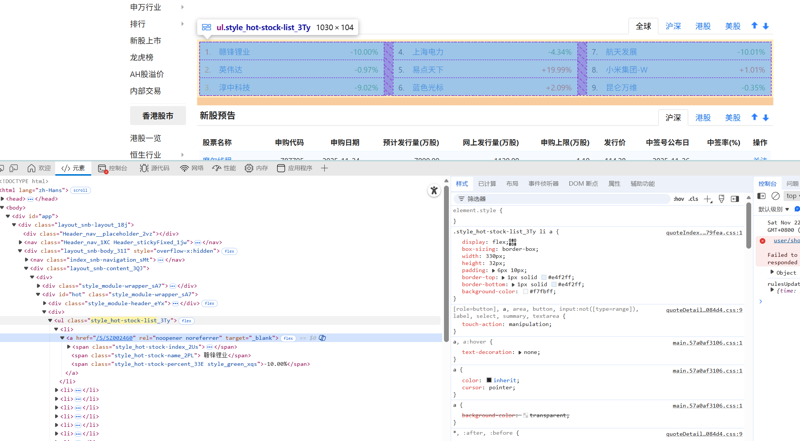
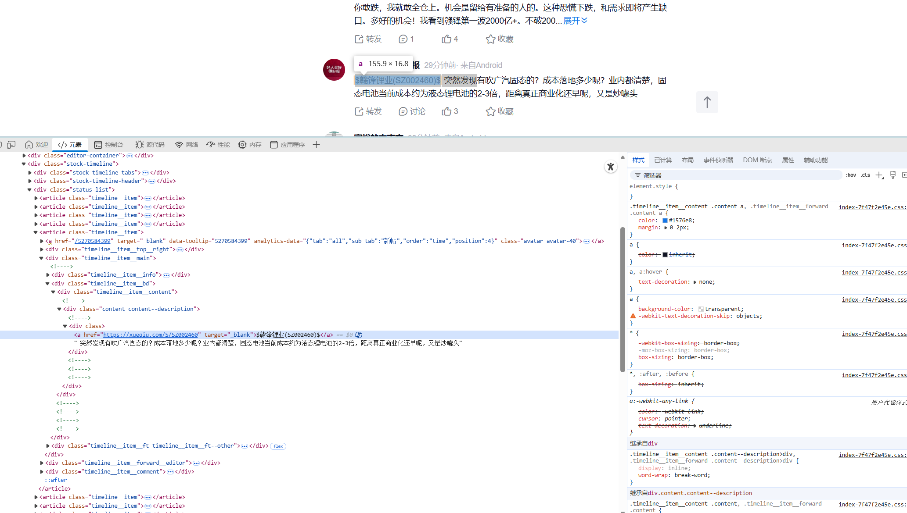

本项目旨在通过爬取股民社区讨论内容，运用自然语言处理和情感分析技术，识别当前股民看好的股票，为投资决策提供情感面参考依据。

<!--more-->


## 数据源选择

> 东方财富股吧 https://guba.eastmoney.com
> 
> 雪球 https://xueqiu.com
> 
> 同花顺 https://t.10jqka.com.cn

## xueqiu股民评论爬取

### 项目配置

```sh
mkdir scrapy-playwright-pj
cd scrapy-playwright-pj
python -m venv venv
source venv/bin/activate
pip install scrapy scrapy-playwright
playwright install chromium

scrapy startproject xueqiu_pj
```

项目结构:
```
┌──(yang㉿yang)-[~/scrapy]
└─$ tree xueqiu_pj/
xueqiu_pj/
├── data
├── scrapy.cfg
└── xueqiu_pj
    ├── __init__.py
    ├── items.py
    ├── middlewares.py
    ├── pipelines.py
    ├── settings.py
    └── spiders
        ├── __init__.py
        └── xueqiu.py
```

### 将 Playwright 集成到 Scrapy

Scrapy 的原理示意图：


#### Downloader 配置修改

修改 `settings.py` ，将 Downloader 更换为 playwright

```python
DOWNLOAD_HANDLERS = {
    "http": "scrapy_playwright.handler.ScrapyPlaywrightDownloadHandler",
    "https": "scrapy_playwright.handler.ScrapyPlaywrightDownloadHandler",
}

# 启用异步 IO 引擎
TWISTED_REACTOR = "twisted.internet.asyncioreactor.AsyncioSelectorReactor"

# 浏览器启动参数
PLAYWRIGHT_LAUNCH_OPTIONS = {
    "headless": False  # 显示浏览器，方便调试
} 
```

#### Spider 模块
> 不使用 PlayWright 的做法
> ```python
> import scrapy
>   class ScrapingClubSpider(scrapy.Spider):
>       name = "xueqiu"
>       allowed_domains = ["xueqiu.com"]
>       start_urls = ["https://xueqiu.com/hq"]
>   
>       def parse(self, response):
>           pass
>```

要通过 Playwright 在 Chrome 中打开页面，需要实现 `start_requests`
```python
class XueqiuSpider(scrapy.Spider):
    name = "xueqiu"
    allowed_domains = ["xueqiu.com"]

    def start_requests(self):
        yield scrapy.Request(
            url='https://xueqiu.com/hq',
            meta={
                'playwright': True
            }
        )

    async def parse(self, response):
        pass
```

##### 获取热门股票信息

为了防止 雪球网站 识别出爬虫，在设置文件中调整一下

```python
# Playwright浏览器启动配置
PLAYWRIGHT_LAUNCH_OPTIONS = {
    "headless": False,              # 显示浏览器界面，方便调试和观察
    "timeout": 120 * 1000,          # 浏览器启动超时时间（2分钟）
    "slow_mo": 1000,               # 每个操作间隔1秒，模拟人类操作速度
    # 浏览器启动参数
    "args": [
        "--disable-infobars",  # 禁用信息栏
        "--disable-blink-features=AutomationControlled",  # 隐藏自动化控制特征
        "--no-sandbox",  # 禁用沙盒模式（适用于Linux环境）
        "--ignore-certificate-errors",  # 忽略证书错误
        "--disable-dev-shm-usage",  # 禁用/dev/shm使用（适用于Docker环境）
        "--disable-gpu",  # 禁用GPU加速
        "--window-size=1200,800",   # 设置浏览器窗口大小
    ]
}

USER_AGENT = "Mozilla/5.0 (Windows NT 10.0; Win64; x64) AppleWebKit/537.36 (KHTML, like Gecko) Chrome/120.0.0.0 Safari/537.36"
```




```python
import scrapy
# 控制浏览器行为
from scrapy_playwright.page import PageMethod

class XueqiuSpider(scrapy.Spider):
    name = "xueqiu"
    allowed_domains = ["xueqiu.com"]

    def start_requests(self):
        yield scrapy.Request(
            url='https://xueqiu.com/hq',
            meta={
                'playwright': True,   # 启用Playwright浏览器渲染
                'playwright_include_page': True,  # 在响应中包含页面对象
                'playwright_page_methods': [
                    # 等待热门股票列表元素出现，最多等待30秒
                    PageMethod("wait_for_selector", "ul[class*='hot-stock']", timeout=30000),
                ]
            }
        )

    async def parse(self, response):
        # 使用CSS选择器定位热门股票列表项
        stock_list = response.css('ul[class*="hot-stock-list"] li')
        # 遍历每个股票列表项
        for item in stock_list:
            link = item.css('a::attr(href)').get()
            stock_code = link.split('/')[-1] if link else None
            rank_span = item.css('span[class*="hot-stock-index"]::text').get()
            name_span = item.css('span[class*="hot-stock-name"]::text').get()
            percent_span = item.css('span[class*="hot-stock-percent"]::text').get()
            if all([rank_span, name_span, percent_span]):
                yield {
                    'rank': rank_span.replace('.', '').strip(),
                    'name': name_span.strip(),
                    'percent': percent_span.strip(),
                    'code': stock_code,
                    'link': response.urljoin(link) if link else None
                }
```

爬取成功：

```
{'rank': '1', 'name': '赣锋锂业', 'percent': '-10.00%', 'code': 'SZ002460', 'link': 'https://xueqiu.com/S/SZ002460'}
2025-11-22 23:34:41 [scrapy.core.scraper] DEBUG: Scraped from <200 https://xueqiu.com/hq>
{'rank': '2', 'name': '英伟达', 'percent': '-0.97%', 'code': 'NVDA', 'link': 'https://xueqiu.com/S/NVDA'}
2025-11-22 23:34:41 [scrapy.core.scraper] DEBUG: Scraped from <200 https://xueqiu.com/hq>
{'rank': '3', 'name': '淳中科技', 'percent': '-9.02%', 'code': 'SH603516', 'link': 'https://xueqiu.com/S/SH603516'}
2025-11-22 23:34:41 [scrapy.core.scraper] DEBUG: Scraped from <200 https://xueqiu.com/hq>
{'rank': '4', 'name': '航天发展', 'percent': '-10.01%', 'code': 'SZ000547', 'link': 'https://xueqiu.com/S/SZ000547'}
2025-11-22 23:34:41 [scrapy.core.scraper] DEBUG: Scraped from <200 https://xueqiu.com/hq>
{'rank': '5', 'name': '上海电力', 'percent': '-4.34%', 'code': 'SH600021', 'link': 'https://xueqiu.com/S/SH600021'}
2025-11-22 23:34:41 [scrapy.core.scraper] DEBUG: Scraped from <200 https://xueqiu.com/hq>
{'rank': '6', 'name': '蓝色光标', 'percent': '+2.09%', 'code': 'SZ300058', 'link': 'https://xueqiu.com/S/SZ300058'}
2025-11-22 23:34:41 [scrapy.core.scraper] DEBUG: Scraped from <200 https://xueqiu.com/hq>
{'rank': '7', 'name': '易点天下', 'percent': '+19.99%', 'code': 'SZ301171', 'link': 'https://xueqiu.com/S/SZ301171'}
2025-11-22 23:34:41 [scrapy.core.scraper] DEBUG: Scraped from <200 https://xueqiu.com/hq>
{'rank': '8', 'name': '小米集团-W', 'percent': '+1.01%', 'code': '01810', 'link': 'https://xueqiu.com/S/01810'}
2025-11-22 23:34:41 [scrapy.core.scraper] DEBUG: Scraped from <200 https://xueqiu.com/hq>
{'rank': '9', 'name': '平潭发展', 'percent': '-10.03%', 'code': 'SZ000592', 'link': 'https://xueqiu.com/S/SZ000592'}
```


##### 获取热门股票股民评论

现在能获取到热门股票的 URL，接下来需要访问这个 URL 里股民的评论




