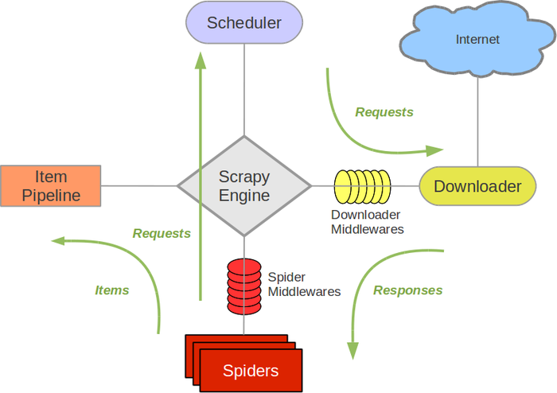
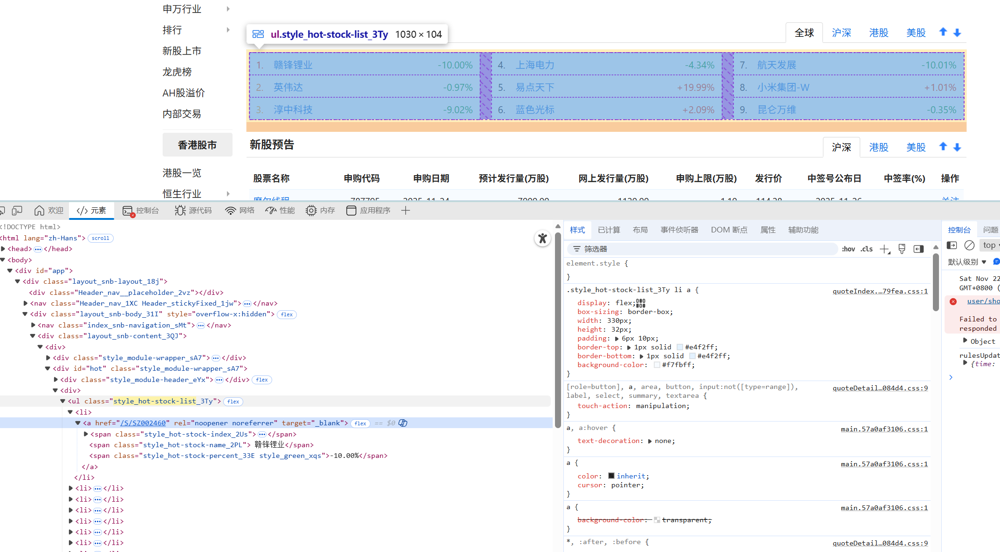
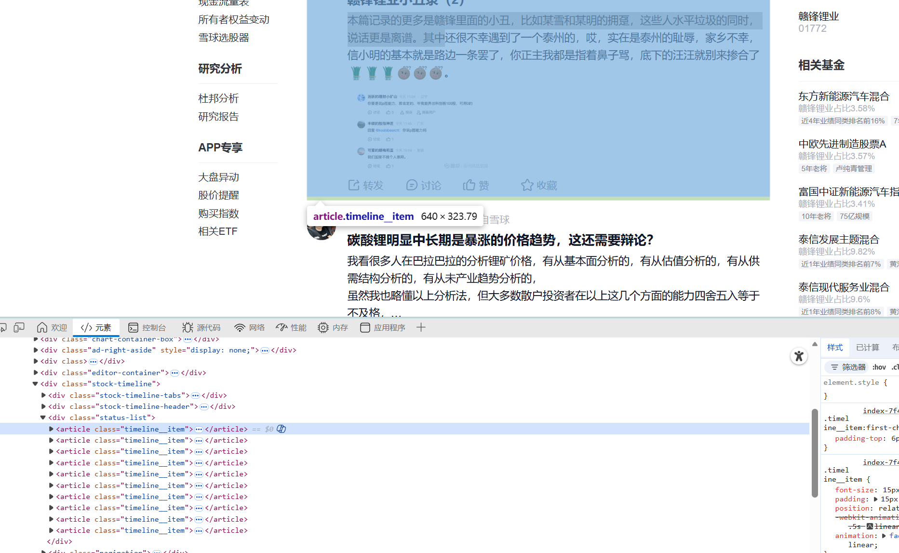
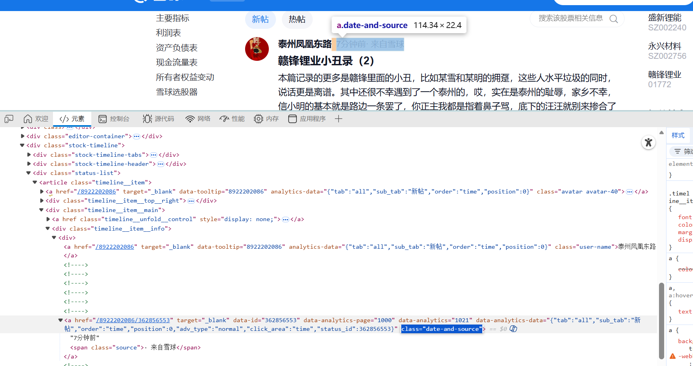
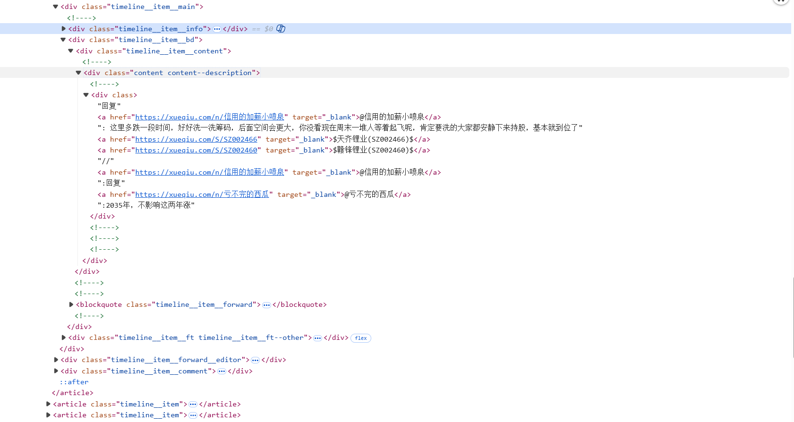

本项目通过自动化采集股民社区讨论内容，结合自然语言处理与情感分析技术，构建市场情感识别模型，为投资决策提供情感维度的量化参考依据。

<!--more-->

## 系统整体架构

系统采用分层架构设计模式，实现组件间低耦合、高内聚，确保扩展性与可维护性。整体架构由五个核心层次组成，构建了从原始数据采集到分析结果可视化的完整处理链路：

```
[多源数据采集层] → [数据预处理层] → [情感分析引擎] → [数据存储层] → [分析可视化层]
       ↓                ↓                ↓              ↓                ↓
Scrapy+Playwright   Pandas/NumPy    LLM+规则混合模型 JSONL/关系型数据库 Matplotlib/Seaborn
```

**爬虫模块: Scrapy + Playwright**
- **Scrapy**: 高性能异步爬虫框架，提供完整的请求调度、数据提取与管道处理机制
- **Playwright**: 现代化浏览器自动化工具，支持JavaScript动态渲染页面爬取，具备强大的页面交互能力

**数据处理引擎: Pandas + NumPy**
- **Pandas**: 专业数据分析库，提供高效的数据清洗、转换与结构化处理能力
- **NumPy**: 科学计算基础库，提供高性能矩阵运算支持，为情感分析提供数值计算基础

**情感分析引擎: 混合模型架构**
- **规则基础层**: 基于jieba分词与金融领域情感词典，实现初步情感倾向识别
- **深度学习增强层**: 利用大语言模型(LLM)进行复杂语义理解与上下文分析，提升情感判断准确性

## 数据源选择

| 数据源 | 平台特点 | 用户画像 | 数据特性 | 采集优先级 |
|-------|---------|---------|---------|----------|
| **雪球网**<br>(https://xueqiu.com) | 专业投资社区，内容深度较高 | 机构投资者、专业投资者、资深散户 | 讨论质量高、结构化程度好、数据粒度适中 | 高 |
| **东方财富股吧**<br>(https://guba.eastmoney.com) | 综合性财经社区，用户基数大 | 散户为主，活跃度高 | 数据量大、情感表达直接、实时强劲 | 高 |
| **同花顺**<br>(https://t.10jqka.com.cn) | 金融信息服务平台，功能全面 | 多元化投资者群体 | 财经数据丰富、互动内容多样、用户基础广泛 | 中 |

## 雪球网数据采集实现

### 项目初始化与环境配置

```sh
mkdir scrapy-playwright-pj
cd scrapy-playwright-pj
python -m venv venv
source venv/bin/activate
pip install scrapy scrapy-playwright
playwright install chromium
# 项目初始化
scrapy startproject stock_sentiment_analysis
cd stock_sentiment_analysis
```

生成爬虫模块
```sh
scrapy genspider xueqiu xueqiu.com
```

启动爬虫
```sh
scrapy crawl xueqiu
```

项目目录结构
```
stock_sentiment_analysis/
├── scrapy.cfg                 # 项目配置文件
├── stock_sentiment_analysis/  # 主项目目录
│   ├── __init__.py
│   ├── items.py               # 数据模型定义
│   ├── middlewares.py         # 中间件配置
│   ├── pipelines.py           # 数据处理管道
│   ├── settings.py            # 全局配置
│   └── spiders/               # 爬虫模块目录
│       ├── __init__.py
│       └── xueqiu_spider.py   # 雪球网爬虫实现
└── output/                    # 数据输出目录
```

### 将 Playwright 集成到 Scrapy

#### Scrapy 工作流



Scrapy 采用组件化架构设计，其核心工作流程包括：
- **调度器(Scheduler)**: 管理请求队列，根据优先级和去重策略分配下载任务
- **下载器(Downloader)**: 负责获取网页内容，支持多种下载处理器插件
- **爬虫(Spider)**: 定义爬取规则，提取目标数据
- **管道(Pipeline)**: 处理和存储提取的数据
- **中间件(Middleware)**: 提供请求/响应处理的钩子机制

#### 异步下载器架构设计

传统爬虫难以处理现代 Web 应用中的 JavaScript 动态渲染内容，本系统通过集成 Playwright 解决这一挑战。以下是关键配置实现：

```python
# settings.py

# 替换默认下载器为 Playwright 下载器
DOWNLOAD_HANDLERS = {
    "http": "scrapy_playwright.handler.ScrapyPlaywrightDownloadHandler",
    "https": "scrapy_playwright.handler.ScrapyPlaywrightDownloadHandler",
}

# 启用异步IO引擎以支持 Playwright
TWISTED_REACTOR = "twisted.internet.asyncioreactor.AsyncioSelectorReactor"

# 浏览器实例配置
PLAYWRIGHT_LAUNCH_OPTIONS = {
    "headless": False,  # 调试模式，调试完后可设为True
    "timeout": 60 * 1000,  
    "args": [
        "--disable-infobars",  # 隐藏信息栏
        "--disable-blink-features=AutomationControlled",  # 绕过反爬检测
        "--no-sandbox",  # 非沙箱模式，Linux环境下需要
        "--ignore-certificate-errors",  # 忽略证书错误
    ]
}

USER_AGENT = "Mozilla/5.0 (Windows NT 10.0; Win64; x64) AppleWebKit/537.36 (KHTML, like Gecko) Chrome/120.0.0.0 Safari/537.36"

# 并发控制配置
CONCURRENT_REQUESTS = 5  # 控制并发请求数
DOWNLOAD_DELAY = 2  # 设置下载延迟，避免请求过快

# 重试机制配置
RETRY_ENABLED = True
RETRY_TIMES = 3
RETRY_HTTP_CODES = [429, 500, 502, 503, 504]

# 启用日志记录
LOG_LEVEL = 'INFO'
LOG_STDOUT = True
```

#### 异步爬虫模块设计

通过结合Scrapy的异步框架与Playwright的浏览器自动化能力，实现了高效、稳定的数据采集。

**同步vs异步爬虫模式对比**

| 特性 | 传统同步爬虫 | 异步Playwright爬虫 |
|------|------------|------------------|
| 渲染能力 | 仅支持静态HTML | 完整支持JavaScript动态渲染 |
| 交互能力 | 无 | 支持点击、滚动、表单填写等复杂交互 |
| 反爬规避 | 能力有限 | 模拟真实浏览器行为，规避大多数反爬机制 |
| 性能模型 | 阻塞式IO | 非阻塞式IO，高并发处理能力 |
| 错误恢复 | 简单重试 | 可结合浏览器状态恢复，更健壮 |

```python
# 传统同步爬虫模式
class TraditionalStockSpider(scrapy.Spider):
    name = "traditional_xueqiu"
    allowed_domains = ["xueqiu.com"]
    start_urls = ["https://xueqiu.com/hq"]
  
    def parse(self, response):
        # 无法处理需要JavaScript渲染的动态内容
        # 无法执行页面交互操作
        pass
```

```python
# 异步 Playwright 爬虫模式
import scrapy
from scrapy_playwright.page import PageMethod
from stock_sentiment_analysis.items import StockCommentItem

class XueqiuSpider(scrapy.Spider):
    name = "xueqiu_spider"
    allowed_domains = ["xueqiu.com"]
    custom_settings = {
        'DOWNLOAD_DELAY': 2, 
        'CONCURRENT_REQUESTS': 5,  # 控制并发请求数
    }

    async def start_requests(self):
        """初始化爬虫，配置 Playwright 浏览器参数"""
        self.logger.info("开始爬取雪球热门股票数据")
        yield scrapy.Request(
            url='https://xueqiu.com/hq',
            meta={
                'playwright': True,  # 启用Playwright处理
                'playwright_include_page': True,  # 允许直接操作页面实例
                'playwright_page_methods': [
                    # 等待热门股票列表加载完成 - 显式等待机制
                    PageMethod("wait_for_selector", "ul[class*='hot-stock-list']", timeout=30000),
                    PageMethod('wait_for_timeout', 2000),  # 额外等待确保渲染完成
                ]
            }
        )
```

### 获取热门股票数据

系统采用多级解析策略，先从热点股票列表页面提取基础信息，然后为每只目标股票创建独立的评论爬取任务。

这种设计实现了数据提取与深入爬取的解耦，提高系统的可靠性以及可扩展性。


查看热门股票页的前端结构：




```python
import scrapy
from scrapy_playwright.page import PageMethod
from stock_sentiment_analysis.items import StockCommentItem

class XueqiuSpider(scrapy.Spider):
    name = "xueqiu_spider"
    allowed_domains = ["xueqiu.com"]
    custom_settings = {
        'DOWNLOAD_DELAY': 2, 
        'CONCURRENT_REQUESTS': 5,  
    }

    async def start_requests(self):
        """初始化爬虫，请求热门股票页面
        
        设置Playwright参数，确保能够正确渲染动态加载的热门股票列表内容
        采用显式等待策略，提高页面加载的可靠性
        """
        self.logger.info("开始爬取雪球热门股票数据")
        yield scrapy.Request(
            url='https://xueqiu.com/hq',
            meta={
                'playwright': True, 
                'playwright_include_page': True, 
                'playwright_page_methods': [
                    PageMethod("wait_for_selector", "ul[class*='hot-stock-list']", timeout=30000),
                    PageMethod('wait_for_timeout', 2000),
                ]
            }
        )

    async def parse(self, response):
        """提取热门股票列表信息并发起详情页请求
        
        作为爬虫的数据提取核心方法，采用异步处理模式，实现了高效的数据提取与任务分发。
        关键技术点包括：健壮的CSS选择器策略、数据完整性校验、元数据传递机制。
        """
        stock_list = response.css('ul[class*="hot-stock-list"] li')
        
        self.logger.info(f"成功定位并解析到{len(stock_list)}支热门股票")
        
        # 遍历每个股票列表项提取关键信息
        for item in stock_list:
            link = item.css('a::attr(href)').get()
            stock_code = link.split('/')[-1] if link else None
            
            # 使用语义化的CSS选择器提取股票核心指标
            rank_span = item.css('span[class*="hot-stock-index"]::text').get()
            name_span = item.css('span[class*="hot-stock-name"]::text').get()
            percent_span = item.css('span[class*="hot-stock-percent"]::text').get()
            
            if all([rank_span, name_span, percent_span, stock_code]):
                # 构建标准化的股票信息字典，规范化数据格式
                stock_info = {
                    'rank': rank_span.replace('.', '').strip(),  
                    'name': name_span.strip(),
                    'percent': percent_span.strip(), 
                    'code': stock_code, 
                    'link': response.urljoin(link) if link else None 
                }
                self.logger.debug(f"成功提取股票信息: {stock_info['name']}({stock_info['code']})")
                
                # 为每只股票创建独立的评论爬取任务
                yield scrapy.Request(
                    url=response.urljoin(link),
                    callback=self.parse_comments,  # 指定评论解析回调函数
                    meta={
                        'playwright': True,  
                        'playwright_include_page': True,
                        'playwright_page_methods': [
                            PageMethod("wait_for_selector", "article[class*='timeline__item']", timeout=30000),
                        ],
                        **stock_info  # 解包传递股票基本信息，实现数据链路完整性
                    },
                )
            else:
                self.logger.warning(f"股票数据不完整，跳过处理: 排名={rank_span}, 名称={name_span}, 涨跌幅={percent_span}")
```

输出结果：

```
{'rank': '1', 'name': '赣锋锂业', 'percent': '-10.00%', 'code': 'SZ002460', 'link': 'https://xueqiu.com/S/SZ002460'}
2025-11-22 23:34:41 [scrapy.core.scraper] DEBUG: Scraped from <200 https://xueqiu.com/hq>
{'rank': '2', 'name': '英伟达', 'percent': '-0.97%', 'code': 'NVDA', 'link': 'https://xueqiu.com/S/NVDA'}
2025-11-22 23:34:41 [scrapy.core.scraper] DEBUG: Scraped from <200 https://xueqiu.com/hq>
{'rank': '3', 'name': '淳中科技', 'percent': '-9.02%', 'code': 'SH603516', 'link': 'https://xueqiu.com/S/SH603516'}
2025-11-22 23:34:41 [scrapy.core.scraper] DEBUG: Scraped from <200 https://xueqiu.com/hq>
{'rank': '4', 'name': '航天发展', 'percent': '-10.01%', 'code': 'SZ000547', 'link': 'https://xueqiu.com/S/SZ000547'}
2025-11-22 23:34:41 [scrapy.core.scraper] DEBUG: Scraped from <200 https://xueqiu.com/hq>
{'rank': '5', 'name': '上海电力', 'percent': '-4.34%', 'code': 'SH600021', 'link': 'https://xueqiu.com/S/SH600021'}
2025-11-22 23:34:41 [scrapy.core.scraper] DEBUG: Scraped from <200 https://xueqiu.com/hq>
{'rank': '6', 'name': '蓝色光标', 'percent': '+2.09%', 'code': 'SZ300058', 'link': 'https://xueqiu.com/S/SZ300058'}
2025-11-22 23:34:41 [scrapy.core.scraper] DEBUG: Scraped from <200 https://xueqiu.com/hq>
{'rank': '7', 'name': '易点天下', 'percent': '+19.99%', 'code': 'SZ301171', 'link': 'https://xueqiu.com/S/SZ301171'}
2025-11-22 23:34:41 [scrapy.core.scraper] DEBUG: Scraped from <200 https://xueqiu.com/hq>
{'rank': '8', 'name': '小米集团-W', 'percent': '+1.01%', 'code': '01810', 'link': 'https://xueqiu.com/S/01810'}
2025-11-22 23:34:41 [scrapy.core.scraper] DEBUG: Scraped from <200 https://xueqiu.com/hq>
{'rank': '9', 'name': '平潭发展', 'percent': '-10.03%', 'code': 'SZ000592', 'link': 'https://xueqiu.com/S/SZ000592'}
```


### 评论数据深度爬取策略

#### 单页评论爬取
分析雪球网评论区的DOM结构，设计可靠高效的CSS选择器策略，实现对动态渲染评论内容的精准提取：




```python
    async def parse_comments(self, response):
        """异步解析股票详情页中的用户评论数据
        
        实现核心功能：
        1. 从meta传递链中恢复股票基础信息
        2. 使用Selector解析Playwright渲染后的完整DOM结构
        3. 应用文本提取算法处理嵌套文本节点
        4. 执行数据质量过滤与标准化
        """
        # 从meta中获取股票基础信息
        stock_rank = response.meta.get('rank')
        stock_name = response.meta.get('name')
        stock_percent = response.meta.get('percent')
        stock_code = response.meta.get('code')
        stock_url = response.meta.get('link')
        
        # 资源管理：释放Playwright页面实例
        page = response.meta["playwright_page"]
        await page.close()  # 显式关闭页面，避免内存泄漏
        
        # 使用Scrapy Selector解析渲染后的HTML内容
        sel = Selector(text=response.text)
        
        articles = sel.css("article[class*='timeline__item']")
        
        if not articles:
            self.logger.warning(f"[{stock_rank}-{stock_name}] 未获取到有效评论数据")
            return
            
        self.logger.info(f"[{stock_rank}-{stock_name}] 成功定位{len(articles)}条评论记录")
```


评论内容DOM结构：

  


```python
            for article in articles:
                # 提取评论元数据
                post_time = article.css('.date-and-source::text').get()
                user_name = article.css('.user-name::text').get()
                
                comment_elements = article.css('div.content--description div ::text')
                user_comment = ''.join(
                    comment_element.get().strip() 
                    for comment_element in comment_elements 
                    if comment_element.get() and comment_element.get().strip()
                )
                
                # 数据质量过滤：实施最小长度检查，过滤无意义短评论
                if not user_comment or len(user_comment.strip()) < 5:
                    continue
                    
                # 构建标准化数据项，实现数据格式统一
                item = StockCommentItem(
                    platform="xueqiu", 
                    stock_rank=stock_rank,    
                    stock_name=stock_name,
                    stock_percent=stock_percent,
                    stock_code=stock_code,
                    stock_url=stock_url,
                    comment_text=user_comment,
                    comment_time=post_time,
                    user_name=user_name,
                    crawl_time=datetime.now().strftime('%Y-%m-%d %H:%M:%S')
                )
                
                self.logger.debug(f"成功提取评论：{stock_name} - {user_comment[:30]}...")
                
                # 返回标准化数据项到处理管道
                yield item
```

#### 分页爬取机制

为实现大规模评论数据的全面采集，系统设计了智能分页爬取机制，能够自适应网站的分页策略，并结合反爬措施确保稳定运行。

```python
    async def parse_comments_with_pagination(self, response):
        """实现分页爬取策略，支持多页评论数据采集
        
        核心功能：
        1. 递归式分页处理，自动发现并抓取所有可用评论页面
        2. 智能等待策略，确保动态加载内容完全渲染
        3. 自适应爬取速率，根据网站响应动态调整
        """
        # 获取当前股票信息
        stock_info = response.meta.get('stock_info', {})
        current_page = response.meta.get('page', 1)
        
        page = response.meta["playwright_page"]
        
        try:
            # 提取评论数据
            # ...评论提取代码...
            
            # 判断是否存在下一页
            next_page_selector = 'button[class*="pagination-next"]'
            is_disabled = await page.is_disabled(next_page_selector)
            
            # 分页策略：最多爬取10页，防止无限循环
            if not is_disabled and current_page < 10:
                await page.wait_for_timeout(random.randint(1000, 3000))
                
                # 点击下一页按钮
                await page.click(next_page_selector)
                
                # 等待新评论加载完成
                await page.wait_for_selector("article[class*='timeline__item']", state="visible")
                
                self.logger.info(f"[{stock_info.get('name')}] 开始爬取第{current_page + 1}页评论")
                
                # 创建下一页爬取任务
                yield scrapy.Request(
                    url=response.url,
                    callback=self.parse_comments_with_pagination,
                    meta={
                        'playwright': True,
                        'playwright_include_page': True,
                        'stock_info': stock_info,
                        'page': current_page + 1,
                        'playwright_page': page  # 复用页面实例，提高性能
                    },
                    dont_filter=True  # 允许重复URL爬取，适应分页机制
                )
            else:
                await page.close()
                self.logger.info(f"[{stock_info.get('name')}] 评论爬取完成，共爬取{current_page}页")
                
        except Exception as e:
            self.logger.error(f"分页爬取异常: {str(e)}")
            await page.close()
```

### 数据处理管道设计

系统实现了高效的数据处理管道，将爬取的原始评论数据转换为结构化的JSON格式，便于后续的情感分析处理。

```python
# items.py
import scrapy
class TestPjItem(scrapy.Item):
    stock_rank = scrapy.Field()
    stock_name = scrapy.Field()
    stock_percent = scrapy.Field()
    stock_code = scrapy.Field()
    stock_url = scrapy.Field()
    post_time = scrapy.Field()
    user_name = scrapy.Field()
    user_comment = scrapy.Field()

```

```python
# xueqiu.py
    item = TestPjItem(
        stock_rank=stock_rank,    
        stock_name=stock_name,
        stock_percent=stock_percent,
        stock_code=stock_code,
        stock_url=stock_url,
        post_time=post_time,
        user_name=user_name,
        user_comment=user_comment
    )
    yield item
```

这就需要修改pipelines，处理数据

```python
import json
import datetime
import os
from itemadapter import ItemAdapter
from scrapy.exceptions import DropItem

class JsonWriterPipeline:
    def __init__(self):
        self.file = None
        self.items_count = 0
        self.output_dir = 'output'
        
    def open_spider(self, spider):
        if not os.path.exists(self.output_dir):
            os.makedirs(self.output_dir)
        
        timestamp = datetime.datetime.now().strftime("%Y%m%d_%H%M%S")
        filename = f"{self.output_dir}/stock_data_{timestamp}.json"
        
        self.file = open(filename, 'w', encoding='utf-8')
        self.file.write('[\n')  
        spider.logger.info(f"数据将保存到: {filename}")
        
    def close_spider(self, spider):
        if self.file:
            if self.items_count > 0:
                self.file.write('\n]') 
            else:
                self.file.write(']') 
            self.file.close()
            spider.logger.info(f"爬虫结束，共保存 {self.items_count} 条数据")
        
    def process_item(self, item, spider):
        adapter = ItemAdapter(item)
        item_dict = dict(adapter)
        
        if self.items_count > 0:
            self.file.write(',\n') 
        
        json_line = json.dumps(item_dict, ensure_ascii=False, indent=2)
        self.file.write(' ' * 2 + json_line)

        self.items_count += 1
        if self.items_count % 10 == 0: 
            self.file.flush()
            spider.logger.info(f"已处理 {self.items_count} 条数据")
        
        return item
```

对应的需要在 setting 中启用管道

```python
# 中间件设置
DOWNLOADER_MIDDLEWARES = {
    # 禁用默认的UserAgentMiddleware，使用自定义的
    "scrapy.downloadermiddlewares.useragent.UserAgentMiddleware": None,
}

# 启用管道
ITEM_PIPELINES = {
    "test_pj.pipelines.JsonWriterPipeline": 100,    
}
```

测试结果: 爬取成功
```JSON
[
  {
  "stock_rank": "1",
  "stock_name": "赣锋锂业",
  "stock_percent": "-10.00%",
  "stock_code": "SZ002460",
  "stock_url": "https://xueqiu.com/S/SZ002460",
  "post_time": "8秒前",
  "user_name": "陪赣锋到老",
  "user_comment": "$赣锋锂业(SZ002460)$ 李总和副点在2022年底的分别以76-81的每股价增15万股、10.39万股，他们至今未减持，人家的钱也是钱，他会怕那些所谓的主力庄家砸盘吗？那些所谓的主力庄家砸盘、能砸掉赣锋的固定资产设备、资源储量、产能、技术专利、市占率、和赣锋客户的对赣锋产品的需求吗？[捂..."
},
......
  {
  "stock_rank": "1",
  "stock_name": "赣锋锂业",
  "stock_percent": "-10.00%",
  "stock_code": "SZ002460",
  "stock_url": "https://xueqiu.com/S/SZ002460",
  "post_time": "2小时前",
  "user_name": "亏不完的西瓜",
  "user_comment": "回复@信用的加薪小喷泉: 这里多跌一段时间，好好洗一洗筹码，后面空间会更大，你没看现在周末一堆人等着起飞呢，肯定要洗的大家都安静下来持股，基本就到位了$天齐锂业(SZ002466)$ $赣锋锂业(SZ002460)$//@信用的加薪小喷泉:回复@亏不完的西瓜:2035年，不影响这两年涨【英国政府推出新的关键矿产战略：到2035年生产至少5万吨锂】英国政府11月22日发布声明称，目标2035年前实现10%的矿产需求由国内生产、20%通过回收再利用满足。声明称，到2035年英国将至少生产5万吨锂，政府将投入约5000万英镑的新一轮资金支持本土企业。"
}
]
```

### 速率限制

实践中单一会话爬取一千六百条多条评论时会触发速率限制，评论区无法再加载。所以使用多级解析。

访问速率过快会弹出阿里云验证界面，需要控制好访问速率


可以看到成功爬取热门的 9 支股票的所有评论


### 爬虫模块实现总结

爬虫部分基于 Scrapy 框架与 Playwright 浏览器自动化工具构建，通过模拟真实浏览器行为实现动态内容加载，有效规避 JavaScript 渲染相关的爬取障碍。

对其他网站源的评论也可以使用相同的技术架构与实现方案。

# 情感分析引擎实现
