学习防火墙的工作原理，使用 Linux 内置的 iptables（基于 netfilter）为网络设置防火墙规则，同时手动实现一个简单的无状态包过滤防火墙。

本实验涵盖从内核模块开发到实际防火墙规则配置的完整过程。

<!--more-->

- Netfilter hook 机制
- Linux 内核模块（LKM）开发
- 无状态包过滤防火墙实现
- iptables 防火墙规则配置
- 有状态防火墙与连接追踪
- 网络流量限制与负载均衡

## Task1-实现一个简单防火墙

实现一个简单的包过滤类型的防火墙，数据包处理在内核进行，过滤也必须在内核中进行。

现代 Linux 提供可加载内核模块 LKM 和 Netfilter 机制，以便在不重新构建内核映像的情况下操作数据包。

### Task1-A 内核模块

LKM 允许在运行时向内核添加一个新模块，扩展内核功能。

防火墙的包过滤功能可以作为一个 LKM 实现。

以下是一个简单的可加载内核模块。它在模块加载时执行 `initialization`；当模块从内核中移除时，执行 `cleanup`。

`printf` 消息不会在屏幕上打印，而是被打印到 `/var/log/syslog` 文件中。使用 `dmesg` 查看这些消息。

```c
#include <linux/module.h>
#include <linux/kernel.h>

int initialization(void)
{
    printk(KERN_INFO "Hello World!\n");
    return 0;
}

void cleanup(void)
{
    printk(KERN_INFO "Bye-bye World!.\n");
}

module_init(initialization);
module_exit(cleanup);

MODULE_LICENSE("GPL");
```

编译成内核模块

```makefile
obj-m += hello.o
  
all:
        make -C /lib/modules/$(shell uname -r)/build M=$(PWD) modules

clean:
        make -C /lib/modules/$(shell uname -r)/build M=$(PWD) clean
```

```bash
sudo insmod hello.ko   # 插入模块
lsmod | grep hello     # 列出模块
sudo rmmod hello       # 移除模块
dmesg                  # 检查消息
sudo dmesg             # 在 Ubuntu 22.04 中需要 sudo 权限
sudo dmesg -c          # 清除内存中的 /var/log/syslog
```

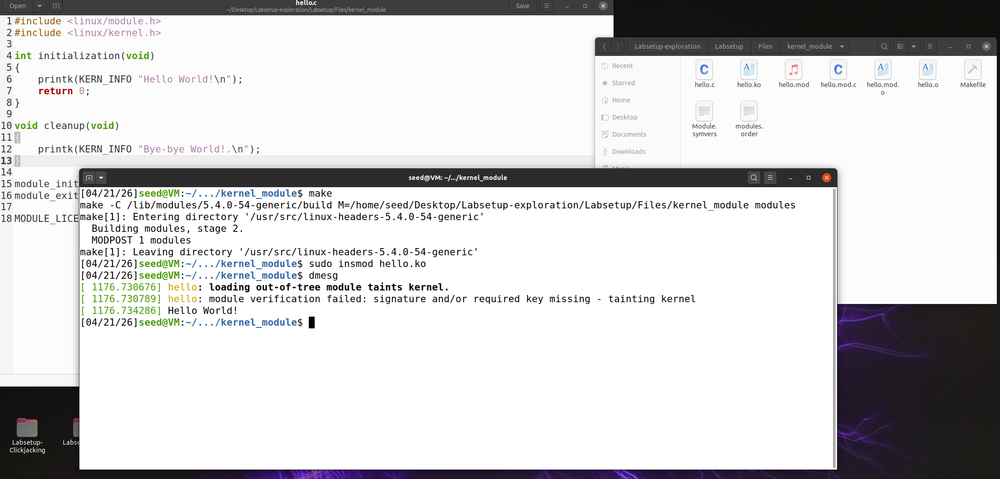

插入模块后，查看日志，发现已经执行初始化函数


### Task1-B 用 Netfilter 实现一个简单的防火墙

Netfilter 旨在方便授权用户操作数据包。

通过在 Linux 内核中实现多个 hook 来实现这个目标，hook 位置包括数据包传入和传出的路径。

操作传入的数据包，只需将自己的程序（在 LKM 内）连接到相应的 hook。

一旦传入的数据包到达，触发 hook 调用程序，程序可以决定是否应该阻止这个数据包或者修改数据包。

```c
#include <linux/kernel.h>
#include <linux/module.h>
#include <linux/netfilter.h>
#include <linux/netfilter_ipv4.h>
#include <linux/ip.h>
#include <linux/tcp.h>
#include <linux/udp.h>
#include <linux/if_ether.h>
#include <linux/inet.h>


static struct nf_hook_ops hook1, hook2; 

// 模块初始化函数
int registerFilter(void) {
   printk(KERN_INFO "Registering filters.\n");

   // 配置第一个钩子（printInfo）
   hook1.hook = printInfo;                  // 设置钩子函数
   hook1.hooknum = NF_INET_LOCAL_OUT;       // 设置钩子点：本地发出的数据包
   hook1.pf = PF_INET;                      // 协议族：IPv4
   hook1.priority = NF_IP_PRI_FIRST;        // 优先级：最高优先级
   nf_register_net_hook(&init_net, &hook1); // 注册钩子

   // 配置第二个钩子（blockUDP）
   hook2.hook = blockUDP;
   hook2.hooknum = NF_INET_POST_ROUTING;    // 设置钩子点：路由后
   hook2.pf = PF_INET;
   hook2.priority = NF_IP_PRI_FIRST;
   nf_register_net_hook(&init_net, &hook2);

   return 0;
}

// 模块退出函数
void removeFilter(void) {
   printk(KERN_INFO "The filters are being removed.\n");
   nf_unregister_net_hook(&init_net, &hook1);
   nf_unregister_net_hook(&init_net, &hook2);
}

module_init(registerFilter);  // 加载模块时调用 registerFilter
module_exit(removeFilter);    // 卸载模块时调用 removeFilter

MODULE_LICENSE("GPL");  // 声明模块许可证为GPL
```

```c
// 第一个 hook 函数，阻止特定 UDP 流量
unsigned int blockUDP(void *priv, struct sk_buff *skb,
                       const struct nf_hook_state *state)
{
   struct iphdr *iph;   // IP 头指针
   struct udphdr *udph; // UDP 头指针

   u16  port   = 53;        // 要阻止的目标端口（DNS端口）
   char ip[16] = "8.8.8.8"; // 要阻止的目标 IP（Google DNS）
   u32  ip_addr;            // 转换后的 IP 地址（32位整数）

   if (!skb) return NF_ACCEPT; // 如果没有数据包，直接接受

   iph = ip_hdr(skb);   // 获取 IP 头
   // 将点分十进制 IP 转换为 32 位二进制格式
   in4_pton(ip, -1, (u8 *)&ip_addr, '\0', NULL);
   
   // 检查是否是UDP协议
   if (iph->protocol == IPPROTO_UDP) {
       udph = udp_hdr(skb);  // 获取UDP头
       // 检查目标IP和目标端口是否匹配
       if (iph->daddr == ip_addr && ntohs(udph->dest) == port){
            printk(KERN_WARNING "*** Dropping %pI4 (UDP), port %d\n", &(iph->daddr), port);
            return NF_DROP;   // 丢弃数据包
        }
   }
   return NF_ACCEPT;  // 接受其他数据包
}
```

```c
// 第二个钩子函数：打印数据包信息
unsigned int printInfo(void *priv, struct sk_buff *skb,
                 const struct nf_hook_state *state)
{
   struct iphdr *iph;  // IP头指针
   char *hook;         // 钩子点名称
   char *protocol;     // 协议名称

   // 根据钩子点类型设置名称
   switch (state->hook){
     case NF_INET_LOCAL_IN:     hook = "LOCAL_IN";     break;   // 进入本地
     case NF_INET_LOCAL_OUT:    hook = "LOCAL_OUT";    break;   // 从本地发出
     case NF_INET_PRE_ROUTING:  hook = "PRE_ROUTING";  break;   // 路由前
     case NF_INET_POST_ROUTING: hook = "POST_ROUTING"; break;   // 路由后
     case NF_INET_FORWARD:      hook = "FORWARD";      break;   // 转发
     default:                   hook = "IMPOSSIBLE";   break;
   }
   printk(KERN_INFO "*** %s\n", hook); // Print out the hook info

   iph = ip_hdr(skb);
   // 根据协议类型设置协议名称
   switch (iph->protocol){
     case IPPROTO_UDP:  protocol = "UDP";   break;
     case IPPROTO_TCP:  protocol = "TCP";   break;
     case IPPROTO_ICMP: protocol = "ICMP";  break;
     default:           protocol = "OTHER"; break;

   }
   // 打印源IP、目标IP和协议类型
   printk(KERN_INFO "    %pI4  --> %pI4 (%s)\n",  &(iph->saddr), &(iph->daddr), protocol);

   return NF_ACCEPT; // 接受数据包
}
```

#### 1 测试代码

编译示例代码，测试发往 8.8.8.8（Google 的 DNS 服务器）的 UDP 请求，预期结果是请求包被拦截。

```bash
dig @8.8.8.8 www.example.com
```

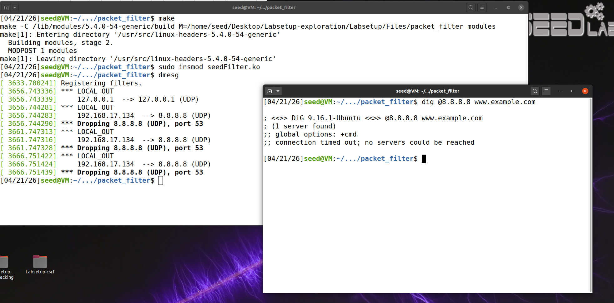

可以看到 Drop 了三个发向 8.8.8.8:53 的 UDP 请求，拦截成功。

#### 2 将 printinfo 挂钩到所有 netfilter hook

```c
#include <linux/kernel.h>
#include <linux/module.h>
#include <linux/netfilter.h>
#include <linux/netfilter_ipv4.h>
#include <linux/ip.h>
#include <linux/tcp.h>
#include <linux/udp.h>
#include <linux/if_ether.h>
#include <linux/inet.h>

static struct nf_hook_ops hook1[5];
static unsigned int hooknums[5] = {
   NF_INET_PRE_ROUTING,
   NF_INET_LOCAL_IN,
   NF_INET_FORWARD,
   NF_INET_LOCAL_OUT,
   NF_INET_POST_ROUTING
   };

static struct nf_hook_ops hook2; 

// 模块初始化函数
int registerFilter(void) {
   int i;
   printk(KERN_INFO "Registering filters.\n");

   // 配置第一个钩子（printInfo）
   for(i = 0; i < 5; i++){
       hook1[i].hook = printInfo;
       hook1[i].hooknum = hooknums[i];
       hook1[i].pf = PF_INET; 
       hook1[i].priority = NF_IP_PRI_FIRST;  
       nf_register_net_hook(&init_net, &hook1[i]); 
   }

   // 配置第二个钩子（blockUDP）
   hook2.hook = blockUDP;
   hook2.hooknum = NF_INET_POST_ROUTING;    // 设置钩子点：路由后
   hook2.pf = PF_INET;
   hook2.priority = NF_IP_PRI_FIRST;
   nf_register_net_hook(&init_net, &hook2);

   return 0;
}

// 模块退出函数
void removeFilter(void) {
   int i;
   printk(KERN_INFO "The filters are being removed.\n");
   /* 注销所有 printInfo 钩子 */
   for (i = 0; i < 5; i++) {
       nf_unregister_net_hook(&init_net, &hook1[i]);
   }
   nf_unregister_net_hook(&init_net, &hook2);
}

module_init(registerFilter);
module_exit(removeFilter);

MODULE_LICENSE("GPL");
```

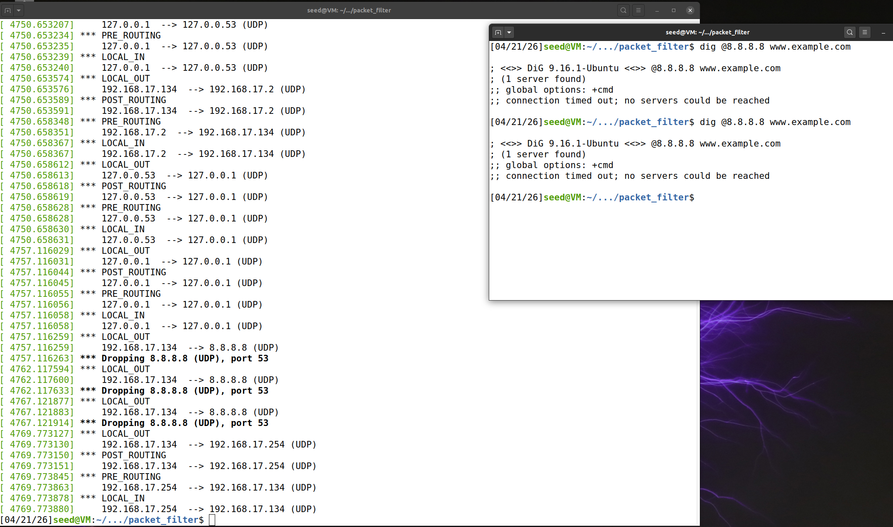

同样编译然后安装模块 insmod，此时多了更多日志信息，其中包含：

- `NF_INET_LOCAL_IN`：数据包已经确实是发往本机的，进入本地进程前被调用
- `NF_INET_LOCAL_OUT`：从本地发出，路由决策之前调用
- `NF_INET_PRE_ROUTING`：进入网络协议栈后，路由决策之前被调用
- `NF_INET_POST_ROUTING`：离开网络协议栈之前被调用
- `NF_INET_FORWARD`：数据包经过路由决策后需要转发，在转发之前调用

#### 3 实现新的 hook 函数

实现两个 hook 函数，注册到同一个 netfilter hook。

打开 10.9.0.5 的容器，运行：（10.9.0.1 是分配给虚拟机的 IP，简单起见可以硬编码这个 IP 地址）

```bash
ping 10.9.0.1
telnet 10.9.0.1
```

```c
struct iphdr   *iph   = ip_hdr(skb)   // (need to include <linux/ip.h>)
struct tcphdr  *tcph  = tcp_hdr(skb)  // (need to include <linux/tcp.h>)
struct udphdr  *udph  = udp_hdr(skb)  // (need to include <linux/udp.h>)
struct icmphdr *icmph = icmp_hdr(skb) // (need to include <linux/icmp.h>)
```

决定使用 `NF_INET_LOCAL_IN`（数据包已经确实是发往本机的，进入本地进程前被调用），这样需要处理的包更少。

##### (1) 防止其他计算机 ping 虚拟机

Ping 使用 ICMP 协议，阻止其他计算机请求本地。

`/lib/modules/5.4.0-54-generic/build/include/uapi/linux/icmp.h`

```c
/* SPDX-License-Identifier: GPL-2.0+ WITH Linux-syscall-note */
/*
 * INET		An implementation of the TCP/IP protocol suite for the LINUX
 *		operating system.  INET is implemented using the  BSD Socket
 *		interface as the means of communication with the user level.
 *
 *		Definitions for the ICMP protocol.
 *
 * Version:	@(#)icmp.h	1.0.3	04/28/93
 *
 * Author:	Fred N. van Kempen, <waltje@uWalt.NL.Mugnet.ORG>
 *
 *		This program is free software; you can redistribute it and/or
 *		modify it under the terms of the GNU General Public License
 *		as published by the Free Software Foundation; either version
 *		2 of the License, or (at your option) any later version.
 */
#ifndef _UAPI_LINUX_ICMP_H
#define _UAPI_LINUX_ICMP_H

#include <linux/types.h>

#define ICMP_ECHOREPLY		0	/* Echo Reply			*/
#define ICMP_DEST_UNREACH	3	/* Destination Unreachable	*/
#define ICMP_SOURCE_QUENCH	4	/* Source Quench		*/
#define ICMP_REDIRECT		5	/* Redirect (change route)	*/
#define ICMP_ECHO		8	/* Echo Request			*/
#define ICMP_TIME_EXCEEDED	11	/* Time Exceeded		*/
#define ICMP_PARAMETERPROB	12	/* Parameter Problem		*/
#define ICMP_TIMESTAMP		13	/* Timestamp Request		*/
#define ICMP_TIMESTAMPREPLY	14	/* Timestamp Reply		*/
#define ICMP_INFO_REQUEST	15	/* Information Request		*/
#define ICMP_INFO_REPLY		16	/* Information Reply		*/
#define ICMP_ADDRESS		17	/* Address Mask Request		*/
#define ICMP_ADDRESSREPLY	18	/* Address Mask Reply		*/
#define NR_ICMP_TYPES		18


/* Codes for UNREACH. */
#define ICMP_NET_UNREACH	0	/* Network Unreachable		*/
#define ICMP_HOST_UNREACH	1	/* Host Unreachable		*/
#define ICMP_PROT_UNREACH	2	/* Protocol Unreachable		*/
#define ICMP_PORT_UNREACH	3	/* Port Unreachable		*/
#define ICMP_FRAG_NEEDED	4	/* Fragmentation Needed/DF set	*/
#define ICMP_SR_FAILED		5	/* Source Route failed		*/
#define ICMP_NET_UNKNOWN	6
#define ICMP_HOST_UNKNOWN	7
#define ICMP_HOST_ISOLATED	8
#define ICMP_NET_ANO		9
#define ICMP_HOST_ANO		10
#define ICMP_NET_UNR_TOS	11
#define ICMP_HOST_UNR_TOS	12
#define ICMP_PKT_FILTERED	13	/* Packet filtered */
#define ICMP_PREC_VIOLATION	14	/* Precedence violation */
#define ICMP_PREC_CUTOFF	15	/* Precedence cut off */
#define NR_ICMP_UNREACH		15	/* instead of hardcoding immediate value */

/* Codes for REDIRECT. */
#define ICMP_REDIR_NET		0	/* Redirect Net			*/
#define ICMP_REDIR_HOST		1	/* Redirect Host		*/
#define ICMP_REDIR_NETTOS	2	/* Redirect Net for TOS		*/
#define ICMP_REDIR_HOSTTOS	3	/* Redirect Host for TOS	*/

/* Codes for TIME_EXCEEDED. */
#define ICMP_EXC_TTL		0	/* TTL count exceeded		*/
#define ICMP_EXC_FRAGTIME	1	/* Fragment Reass time exceeded	*/


struct icmphdr {
  __u8		type;
  __u8		code;
  __sum16	checksum;
  union {
	struct {
		__be16	id;
		__be16	sequence;
	} echo;
	__be32	gateway;
	struct {
		__be16	__unused;
		__be16	mtu;
	} frag;
	__u8	reserved[4];
  } un;
};


/*
 *	constants for (set|get)sockopt
 */

#define ICMP_FILTER			1

struct icmp_filter {
	__u32		data;
};


#endif /* _UAPI_LINUX_ICMP_H */
```

阻止其他虚拟机 ping 虚拟机， 识别 `#define ICMP_ECHO		8` ， ICMP ping 请求

```c
// 第三个 hook 函数，阻止其他虚拟机 Ping 虚拟机
unsigned int blockPing(void *priv, struct sk_buff *skb,
                       const struct nf_hook_state *state)
{
   struct iphdr *iph;   // IP 头指针
   struct icmphdr *icmph; // ICMP 头指针

   char ip[16] = "10.9.0.1"; // 本地虚拟机 IP
   u32  ip_addr;             // 转换后的 IP 地址（32位整数）

   if (!skb) return NF_ACCEPT; // 如果没有数据包，直接接受

   iph = ip_hdr(skb);   // 获取 IP 头
   // 将点分十进制 IP 转换为 32 位二进制格式
   in4_pton(ip, -1, (u8 *)&ip_addr, '\0', NULL);
   
   // 检查是否是 ICMP 协议
   if (iph->protocol == IPPROTO_ICMP) {
       icmph = icmp_hdr(skb);  // 获取 ICMP 头
       // 检查是否是 ICMP Echo 请求，即 Ping 请求
       if (icmph->type == ICMP_ECHO){
           // 检查目标IP和目标端口是否匹配
           if (iph->daddr == ip_addr){
               printk(KERN_WARNING "*** Dropping Ping to %pI4\n", &(iph->daddr));
               return NF_DROP;   // 丢弃数据包
            }
       }
   }
   return NF_ACCEPT;  // 接受其他数据包
}
```

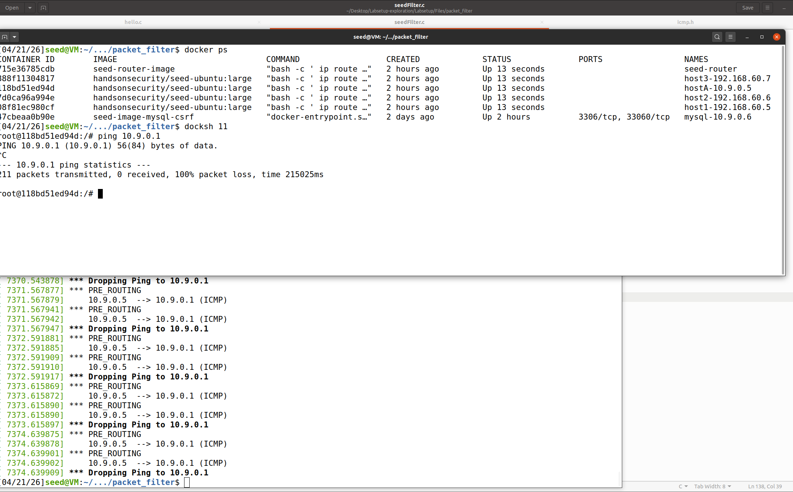

此时其他计算机已经不能 ping 10.9.0.1


##### (2) 防止其他计算机 telnet 到虚拟机

telnet TCP 端口 23。

```c
// 第四个 hook 函数，阻止特定 UDP 流量
unsigned int blockTelnet(void *priv, struct sk_buff *skb,
                       const struct nf_hook_state *state)
{
   struct iphdr *iph;   // IP 头指针
   struct tcphdr *tcph; // TCP 头指针

   u16  port   = 23;        // 要阻止的目标端口（telnet 端口）
   char ip[16] = "10.9.0.1"; // 本虚拟机 IP
   u32  ip_addr;            // 转换后的 IP 地址（32位整数）

   if (!skb) return NF_ACCEPT; // 如果没有数据包，直接接受

   iph = ip_hdr(skb);   // 获取 IP 头
   // 将点分十进制 IP 转换为 32 位二进制格式
   in4_pton(ip, -1, (u8 *)&ip_addr, '\0', NULL);
   
   // 检查是否是 TCP 协议
   if (iph->protocol == IPPROTO_TCP) {
       tcph = tcp_hdr(skb);  // 获取 TCP 头
       // 检查目标 IP 和目标端口是否匹配
       if (iph->daddr == ip_addr && ntohs(tcph->dest) == port){
            printk(KERN_WARNING "*** Dropping %pI4 (TCP), port %d\n", &(iph->daddr), port);
            return NF_DROP;   // 丢弃数据包
        }
   }
   return NF_ACCEPT;  // 接受其他数据包
}
```

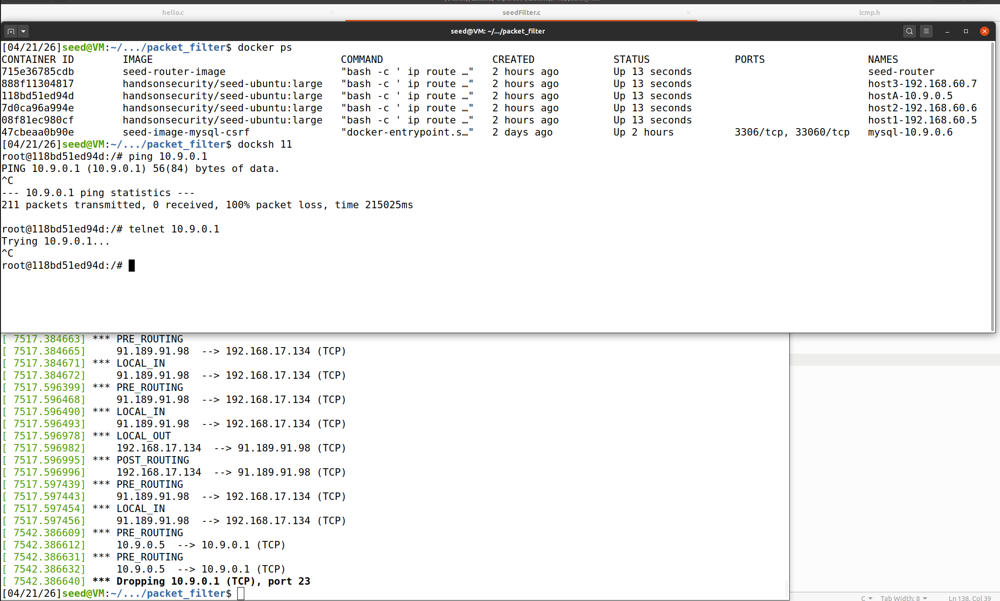

此时其他计算机已经不能 telnet 10.9.0.1


#### 完整代码

```c
#include <linux/kernel.h>
#include <linux/module.h>
#include <linux/netfilter.h>
#include <linux/netfilter_ipv4.h>
#include <linux/ip.h>
#include <linux/tcp.h>
#include <linux/udp.h>
#include <linux/if_ether.h>
#include <linux/inet.h>
#include <linux/icmp.h>


static struct nf_hook_ops hook1[5];
static unsigned int hooknums[5] = {
   NF_INET_PRE_ROUTING,
   NF_INET_LOCAL_IN,
   NF_INET_FORWARD,
   NF_INET_LOCAL_OUT,
   NF_INET_POST_ROUTING
   };

static struct nf_hook_ops hook2; 
static struct nf_hook_ops hook3; 
static struct nf_hook_ops hook4; 

// 第一个 hook 函数，阻止特定 UDP 流量
unsigned int blockUDP(void *priv, struct sk_buff *skb,
                       const struct nf_hook_state *state)
{
   struct iphdr *iph;   // IP 头指针
   struct udphdr *udph; // UDP 头指针

   u16  port   = 53;        // 要阻止的目标端口（DNS端口）
   char ip[16] = "8.8.8.8"; // 要阻止的目标 IP（Google DNS）
   u32  ip_addr;            // 转换后的 IP 地址（32位整数）

   if (!skb) return NF_ACCEPT; // 如果没有数据包，直接接受

   iph = ip_hdr(skb);   // 获取 IP 头
   // 将点分十进制 IP 转换为 32 位二进制格式
   in4_pton(ip, -1, (u8 *)&ip_addr, '\0', NULL);
   
   // 检查是否是UDP协议
   if (iph->protocol == IPPROTO_UDP) {
       udph = udp_hdr(skb);  // 获取UDP头
       // 检查目标IP和目标端口是否匹配
       if (iph->daddr == ip_addr && ntohs(udph->dest) == port){
            printk(KERN_WARNING "*** Dropping %pI4 (UDP), port %d\n", &(iph->daddr), port);
            return NF_DROP;   // 丢弃数据包
        }
   }
   return NF_ACCEPT;  // 接受其他数据包
}

// 第二个钩子函数：打印数据包信息
unsigned int printInfo(void *priv, struct sk_buff *skb,
                 const struct nf_hook_state *state)
{
   struct iphdr *iph;  // IP头指针
   char *hook;         // 钩子点名称
   char *protocol;     // 协议名称

   // 根据钩子点类型设置名称
   switch (state->hook){
     case NF_INET_LOCAL_IN:     hook = "LOCAL_IN";     break;   // 进入本地
     case NF_INET_LOCAL_OUT:    hook = "LOCAL_OUT";    break;   // 从本地发出
     case NF_INET_PRE_ROUTING:  hook = "PRE_ROUTING";  break;   // 路由前
     case NF_INET_POST_ROUTING: hook = "POST_ROUTING"; break;   // 路由后
     case NF_INET_FORWARD:      hook = "FORWARD";      break;   // 转发
     default:                   hook = "IMPOSSIBLE";   break;
   }
   printk(KERN_INFO "*** %s\n", hook); // Print out the hook info

   iph = ip_hdr(skb);
   // 根据协议类型设置协议名称
   switch (iph->protocol){
     case IPPROTO_UDP:  protocol = "UDP";   break;
     case IPPROTO_TCP:  protocol = "TCP";   break;
     case IPPROTO_ICMP: protocol = "ICMP";  break;
     default:           protocol = "OTHER"; break;

   }
   // 打印源IP、目标IP和协议类型
   printk(KERN_INFO "    %pI4  --> %pI4 (%s)\n",  &(iph->saddr), &(iph->daddr), protocol);

   return NF_ACCEPT; // 接受数据包
}

// 第三个 hook 函数，阻止其他虚拟机 Ping 虚拟机
unsigned int blockPing(void *priv, struct sk_buff *skb,
                       const struct nf_hook_state *state)
{
   struct iphdr *iph;   // IP 头指针
   struct icmphdr *icmph; // ICMP 头指针

   char ip[16] = "10.9.0.1"; // 本地虚拟机 IP
   u32  ip_addr;             // 转换后的 IP 地址（32位整数）

   if (!skb) return NF_ACCEPT; // 如果没有数据包，直接接受

   iph = ip_hdr(skb);   // 获取 IP 头
   // 将点分十进制 IP 转换为 32 位二进制格式
   in4_pton(ip, -1, (u8 *)&ip_addr, '\0', NULL);
   
   // 检查是否是 ICMP 协议
   if (iph->protocol == IPPROTO_ICMP) {
       icmph = icmp_hdr(skb);  // 获取 ICMP 头
       // 检查是否是 ICMP Echo 请求，即 Ping 请求
       if (icmph->type == ICMP_ECHO){
           // 检查目标IP和目标端口是否匹配
           if (iph->daddr == ip_addr){
               printk(KERN_WARNING "*** Dropping Ping to %pI4\n", &(iph->daddr));
               return NF_DROP;   // 丢弃数据包
            }
       }
   }
   return NF_ACCEPT;  // 接受其他数据包
}

// 第四个 hook 函数，阻止特定 UDP 流量
unsigned int blockTelnet(void *priv, struct sk_buff *skb,
                       const struct nf_hook_state *state)
{
   struct iphdr *iph;   // IP 头指针
   struct tcphdr *tcph; // TCP 头指针

   u16  port   = 23;        // 要阻止的目标端口（telnet 端口）
   char ip[16] = "10.9.0.1"; // 本虚拟机 IP
   u32  ip_addr;            // 转换后的 IP 地址（32位整数）

   if (!skb) return NF_ACCEPT; // 如果没有数据包，直接接受

   iph = ip_hdr(skb);   // 获取 IP 头
   // 将点分十进制 IP 转换为 32 位二进制格式
   in4_pton(ip, -1, (u8 *)&ip_addr, '\0', NULL);
   
   // 检查是否是 TCP 协议
   if (iph->protocol == IPPROTO_TCP) {
       tcph = tcp_hdr(skb);  // 获取 TCP 头
       // 检查目标 IP 和目标端口是否匹配
       if (iph->daddr == ip_addr && ntohs(tcph->dest) == port){
            printk(KERN_WARNING "*** Dropping %pI4 (TCP), port %d\n", &(iph->daddr), port);
            return NF_DROP;   // 丢弃数据包
        }
   }
   return NF_ACCEPT;  // 接受其他数据包
}

// 模块初始化函数
int registerFilter(void) {
   int i;
   printk(KERN_INFO "Registering filters.\n");

   // 配置第一个钩子（printInfo）
   for(i = 0; i < 5; i++){
       hook1[i].hook = printInfo;
       hook1[i].hooknum = hooknums[i];
       hook1[i].pf = PF_INET; 
       hook1[i].priority = NF_IP_PRI_FIRST;  
       nf_register_net_hook(&init_net, &hook1[i]); 
   }

   // 配置第二个钩子（blockUDP）
   hook2.hook = blockUDP;
   hook2.hooknum = NF_INET_POST_ROUTING;    // 设置钩子点：路由后
   hook2.pf = PF_INET;
   hook2.priority = NF_IP_PRI_FIRST;
   nf_register_net_hook(&init_net, &hook2);

   // 配置第三个钩子（blockPing）
   hook3.hook = blockPing;
   hook3.hooknum = NF_INET_LOCAL_IN;    // 设置钩子点：本地接收之前
   hook3.pf = PF_INET;
   hook3.priority = NF_IP_PRI_FIRST;
   nf_register_net_hook(&init_net, &hook3);

   // 配置第四个钩子（blockTelnet）
   hook4.hook = blockTelnet;
   hook4.hooknum = NF_INET_LOCAL_IN;    // 设置钩子点：本地接收之前
   hook4.pf = PF_INET;
   hook4.priority = NF_IP_PRI_FIRST;
   nf_register_net_hook(&init_net, &hook4);
   return 0;
}

// 模块退出函数
void removeFilter(void) {
   int i;
   printk(KERN_INFO "The filters are being removed.\n");
   /* 注销所有 printInfo 钩子 */
   for (i = 0; i < 5; i++) {
       nf_unregister_net_hook(&init_net, &hook1[i]);
   }
   nf_unregister_net_hook(&init_net, &hook2);
   nf_unregister_net_hook(&init_net, &hook3);
   nf_unregister_net_hook(&init_net, &hook4);
}

module_init(registerFilter);
module_exit(removeFilter);

MODULE_LICENSE("GPL");
```

## Task2-防火墙规则实验

前面使用 netfilter 实现了一个简单防火墙，事实上 Linux 内置一个同样基于 netfilter 的防火墙，即 iptables。

技术上防火墙的内核部分实现称为 Xtables，iptables 是用于配置防火墙的用户空间程序。

iptables 使用分层结构：

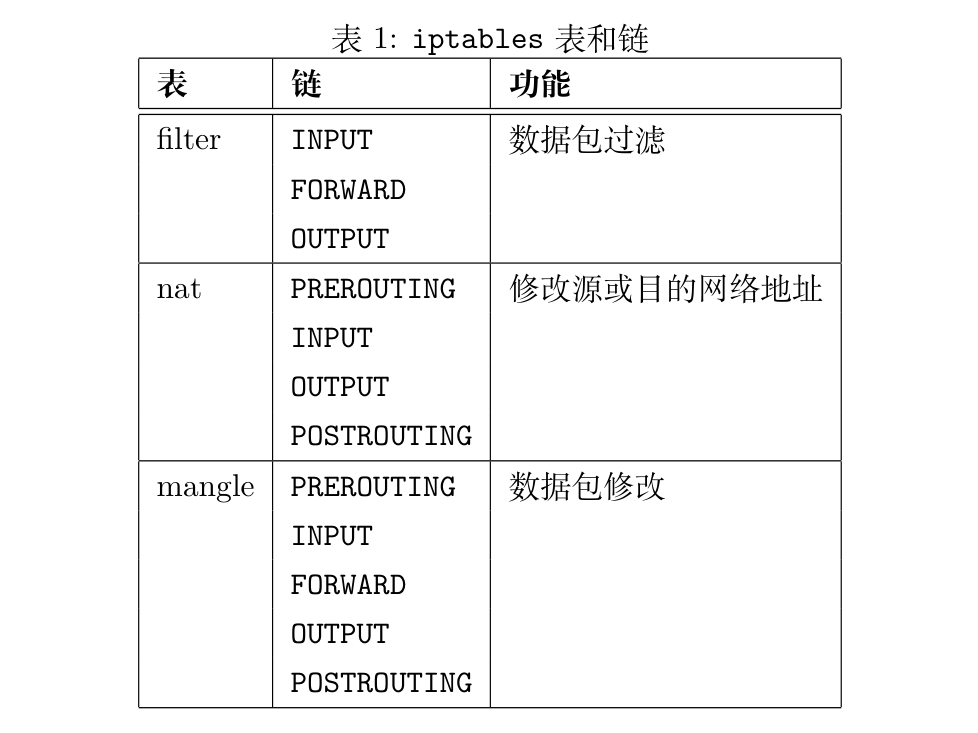

### 使用 iptables

向某个链添加规则，rule 匹配数据包，匹配成功执行一个操作 target。

```bash
sudo su -
iptables -t <table>  -<operation> <chain>  <rule>  -j <target>
#        ----------  --------------------  ------- -----------
#            表               链             规则       动作
```

```bash
iptables -t nat -L -n                      # 列出 nat 表中的所有规则（不显示行号）
iptables -t filter -L -n --line-numbers    # 列出 filter 表中的所有规则（不显示行号）
iptables -t filter -D INPUT 2              # 从 filter 表的 INPUT 链中删除第2条规则
iptables -t filter -A INPUT <rule> -j DROP # 添加规则：DROP 所有满足 <规则> 的传入包
```

### Task2-A 保护路由器

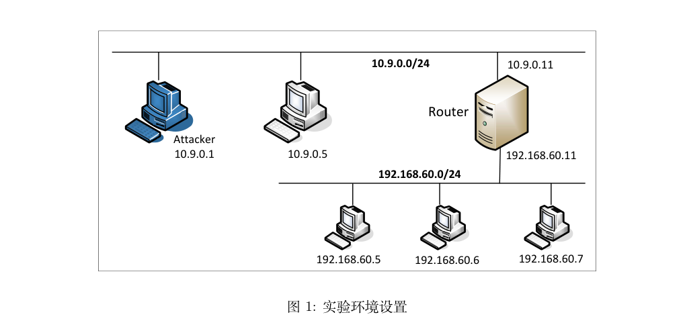

设置规则防止外部机器访问路由器，ping 除外。

-A：Append

-d：destination

-p：protocol

在路由器容器中：

```bash
# 允许进入服务器的 ICMP Echo Request 数据包
iptables -A INPUT -p icmp --icmp-type echo-request -j ACCEPT

# 允许服务器发出的 ICMP Echo Reply 数据包
iptables -A OUTPUT -p icmp --icmp-type echo-reply -j ACCEPT

# 设置 OUTPUT 链的默认策略为 DROP 
# 所有从本机主动发起的、未被前面规则明确允许的出站流量，将被全部丢弃。
iptables -P OUTPUT DROP 

# 设置 INPUT 链的默认策略为 DROP
# 所有发往本机的、未被前面规则明确允许的入站流量，将被全部丢弃
iptables -P INPUT DROP
```

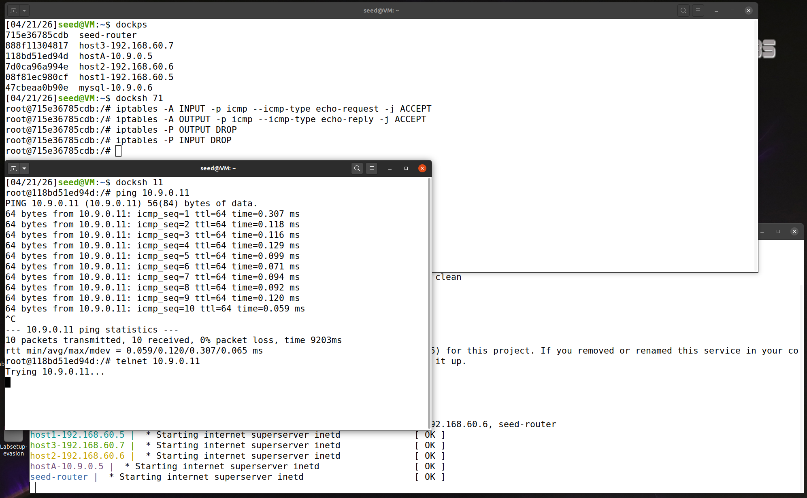

清理：

```bash
# 清空所有自定义规则
iptables -F
# 将 OUTPUT 链的默认策略设置为 ACCEPT
iptables -P OUTPUT ACCEPT
# 将 INPUT 链的默认策略设置为 ACCEPT
iptables -P INPUT ACCEPT
```

### Task2-B 保护内部网络

在路由器上设置防火墙规则，以保护内部网络 `192.168.60.0/24`。使用 FORWARD 链来完成这一任务。

- 外部主机不能 ping 内部主机
- 外部主机可以 ping 路由器
- 内部主机可以 ping 外部主机
- 内外部网络之间的其他数据包应当被阻止


在路由器中：

```bash
root@715e36785cdb:/# ip addr
1: lo: <LOOPBACK,UP,LOWER_UP> mtu 65536 qdisc noqueue state UNKNOWN group default qlen 1000
    link/loopback 00:00:00:00:00:00 brd 00:00:00:00:00:00
    inet 127.0.0.1/8 scope host lo
       valid_lft forever preferred_lft forever
14: eth0@if15: <BROADCAST,MULTICAST,UP,LOWER_UP> mtu 1500 qdisc noqueue state UP group default 
    link/ether 02:42:0a:09:00:0b brd ff:ff:ff:ff:ff:ff link-netnsid 0
    inet 10.9.0.11/24 brd 10.9.0.255 scope global eth0
       valid_lft forever preferred_lft forever
18: eth1@if19: <BROADCAST,MULTICAST,UP,LOWER_UP> mtu 1500 qdisc noqueue state UP group default 
    link/ether 02:42:c0:a8:3c:0b brd ff:ff:ff:ff:ff:ff link-netnsid 0
    inet 192.168.60.11/24 brd 192.168.60.255 scope global eth1
       valid_lft forever preferred_lft forever
```

内部网络 `192.168.60.0/24` 的接口是 `eth1`

外部网络 `10.9.0.0/24` 的接口是 `eth0`

```bash
# 外部主机不能 ping 内部主机
iptables -A FORWARD -i eth0 -o eth1 -p icmp --icmp-type echo-request -j DROP

# 外部主机可以 ping 路由器
# 内部主机可以 ping 外部主机
iptables -A FORWARD -i eth1 -p icmp --icmp-type echo-request -j ACCEPT
iptables -A FORWARD -i eth0 -p icmp --icmp-type echo-reply -j ACCEPT

# 内外部网络之间的其他数据包应当被阻止
iptables -P FORWARD DROP

# ------------
# 清空规则表
iptables -F
iptables -P FORWARD ACCEPT
```

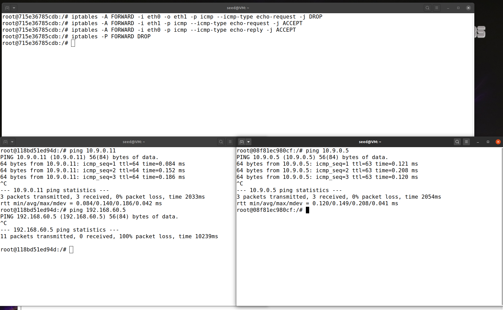

左下为外部计算机 10.9.0.5，右下为内部计算机 192.168.60.5

10.9.0.5 可以 ping 路由器，但是不能 ping 192.168.60.5

内部计算机可以 ping 10.9.0.5

### Task2-C 保护内部服务器


- 所有内部主机都运行了一个 telnet 服务器（监听端口 23）。外部主机只能访问 192.168.60.5 上的 telnet 服务器，不能访问其他内部主机
- 外部主机不能访问其他内部服务器
- 内部主机可以访问所有内部服务器
- 内部主机不能访问外部服务器
- 在本任务中，不允许使用连接追踪机制，它将在后续任务中使用

在浏览器中：

```bash
# 外部主机能访问 192.168.60.5 上的 telnet 服务器
iptables -A FORWARD -i eth0 -p tcp -d 192.168.60.5 --dport 23 -j ACCEPT
iptables -A FORWARD -i eth1 -p tcp -s 192.168.60.5 --sport 23 -j ACCEPT

# 外部主机不能访问其他内部服务器
iptables -A FORWARD -i eth0 -j DROP

# 内部主机可以访问所有内部服务器
iptables -A FORWARD -i eth1 -o eth1  -j ACCEPT

# 内部主机不能访问外部服务器
iptables -A FORWARD -i eth1 -o eth0  -j DROP

# ------------
# 清空规则表
iptables -F
iptables -P FORWARD ACCEPT
```

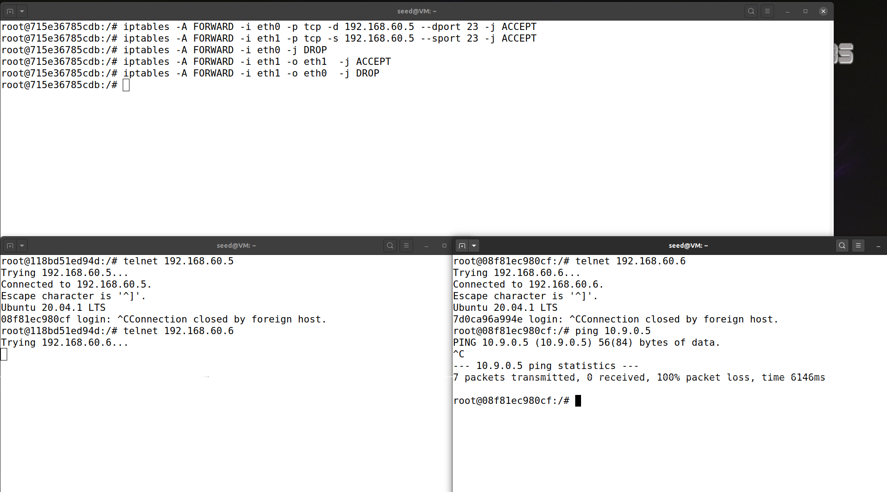

左下外部计算机，右下内部计算机

外部主机可以 ping 路由器 10.9.0.11，但不能 ping 内部计算机

内部计算机可以 ping 外部计算机


## Task3-连接追踪与有状态防火墙

无状态防火墙，逐个检查每个数据包。然而，数据包通常不是独立的，它们可能是某个 TCP 连接的一部分。

如果仅允许在建立连接之后才能进入网络的 TCP 数据包，使用无状态数据包过滤器无法简单实现，因为当防火墙检查每个单独的 TCP 数据包时，它无法知道该数据包是否属于一个已建立的连接，除非防火墙为每个连接维护一些状态信息。如果防火墙这样做，它就变成了有状态防火墙。

### Task3-A 连接追踪实验

追踪连接状态，通过内核的 `conntrack` 模块实现。

```bash
conntrack -L
```

#### ICMP


正在 ping 时每次查看连接状态都输出：

```bash
root@715e36785cdb:/# conntrack -L
icmp     1 29 src=10.9.0.5 dst=192.168.60.5 type=8 code=0 id=52 src=192.168.60.5 dst=10.9.0.5 type=0 code=0 id=52 mark=0 use=1
conntrack v1.4.5 (conntrack-tools): 1 flow entries have been shown.
```

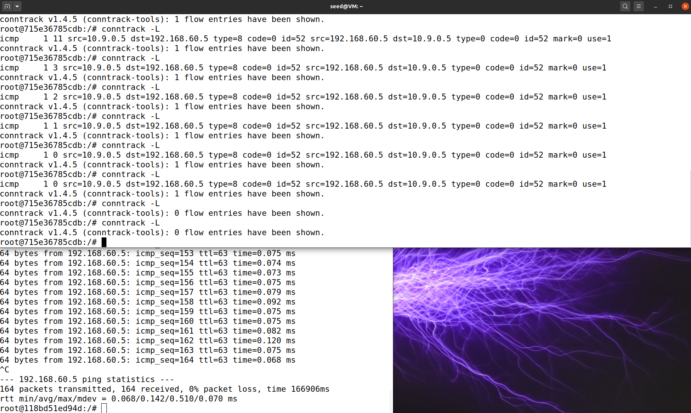

关闭连接后注意到第二个数从 29 连续减到 0，之后再也没有跟踪信息：

```bash
root@715e36785cdb:/# conntrack -L
icmp     1 0 src=10.9.0.5 dst=192.168.60.5 type=8 code=0 id=52 src=192.168.60.5 dst=10.9.0.5 type=0 code=0 id=52 mark=0 use=1
conntrack v1.4.5 (conntrack-tools): 1 flow entries have been shown.
```

```bash
root@715e36785cdb:/# conntrack -L
conntrack v1.4.5 (conntrack-tools): 0 flow entries have been shown.
```

可以猜测 ICMP 连接状态保持 30 秒。


#### UDP

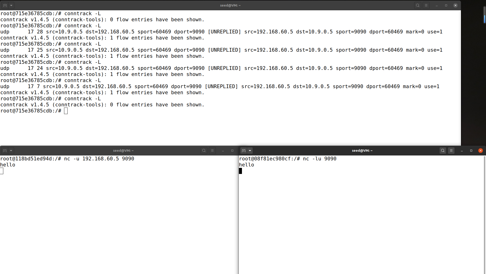

停止发消息后，30 秒后就没有跟踪信息。

然后继续发消息，发现又可以追踪到连接信息。

UDP 连接状态同样保持 30 秒。

#### TCP

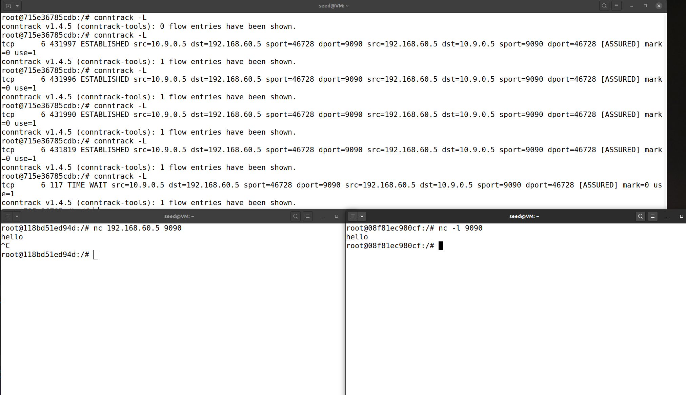

432000 秒 = 5 * 24 * 60 * 60，也就是说，跟踪 TCP 连接状态保持 5 天。

但是在关闭 TCP 连接后，跟踪信息的状态变为 TIME_WAIT，连接状态保持 120 秒。


### Task3-B 设置有状态防火墙

`-m conntrack` 表示正在实验 `conntrack` 模块跟踪连接状态。

`--ctstate ESTABLISHED,RELATED` 表示数据包是否属于 ESTABLISHED 或 RELATED 连接。

```bash
# 允许属于现有连接的 TCP 数据包通过
iptables -A FORWARD -p tcp -m conntrack --ctstate ESTABLISHED,RELATED -j ACCEPT

# 允许建立连接的 SYN 包通过
iptables -A FORWARD -p tcp -i eth0 --dport 8080 --syn -m conntrack --ctstate NEW -j ACCEPT

iptables -P FORWARD DROP
```

用连接追踪机制重写 Task2-C，并新增一条规则：

- 所有内部主机都运行了一个 telnet 服务器（监听端口 23）。外部主机只能访问 192.168.60.5 上的 telnet 服务器，不能访问其他内部主机
- 外部主机不能访问其他内部服务器
- 内部主机可以访问所有内部服务器
- **允许内部主机访问任何外部服务器的规则**

```bash
# 外部主机能与 192.168.60.5 上的 telnet 服务器建立连接
iptables -A FORWARD -p tcp -i eth0 -d 192.168.60.5 --dport 23 --syn -m conntrack --ctstate NEW -j ACCEPT
# 内部主机能与所有服务器（内网/外网）建立连接
iptables -A FORWARD -i eth1 -m conntrack --ctstate NEW -j ACCEPT

# 允许属于现有连接的数据包通过
iptables -A FORWARD -m conntrack --ctstate ESTABLISHED,RELATED -j ACCEPT

# 默认策略：DROP
iptables -P FORWARD DROP

# ------------
# 清空规则表
iptables -F
iptables -P FORWARD ACCEPT
```

如果不使用连接追踪，使用无状态防火墙，对每个方向的数据包都需要单独设置规则，允许请求、允许响应，很麻烦。

有状态防火墙只需要设置好允许哪些连接，再允许属于当前连接的数据包通过即可。

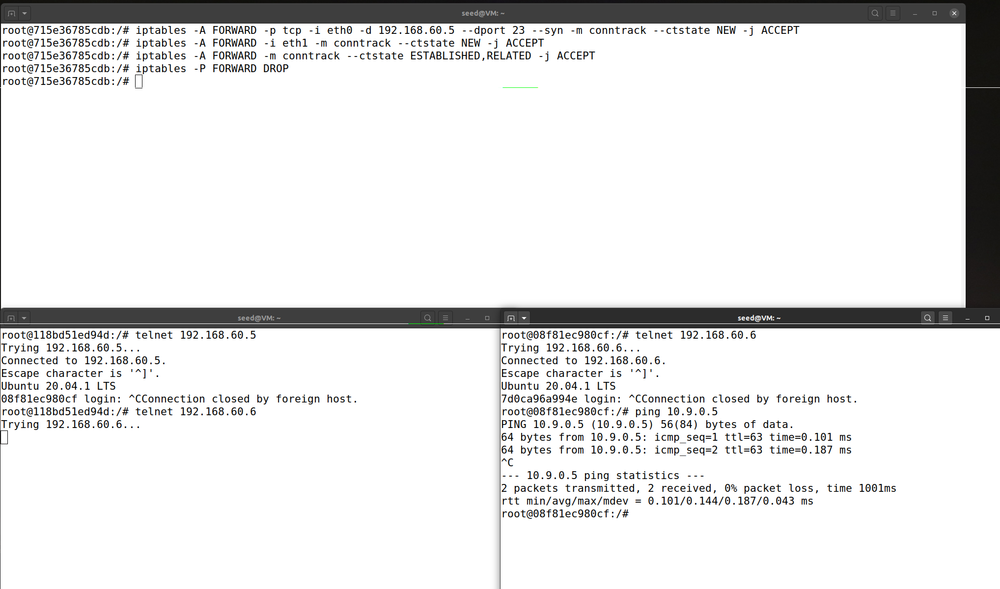

左下外部主机，可以 telnet 到内网的 192.168.60.5，但是不能 telnet 到内网其他主机

右下内部主机，可以 telnet 到内网其他计算机，也可以 ping 外部网络


## Task4-限制网络流量

使用 `iptables` 的 `limit` 模块实现限制通过防火墙的数据包数量。

```bash
# 平均匹配速率为 10/分钟 初始突发容量为 5 个数据包
iptables -A FORWARD -s 10.9.0.5 -m limit --limit 10/minute --limit-burst 5 -j ACCEPT
# 丢弃所有剩余数据包
iptables -A FORWARD -s 10.9.0.5 -j DROP
```

在 10.9.0.5 ping 192.168.60.5，实验结果：

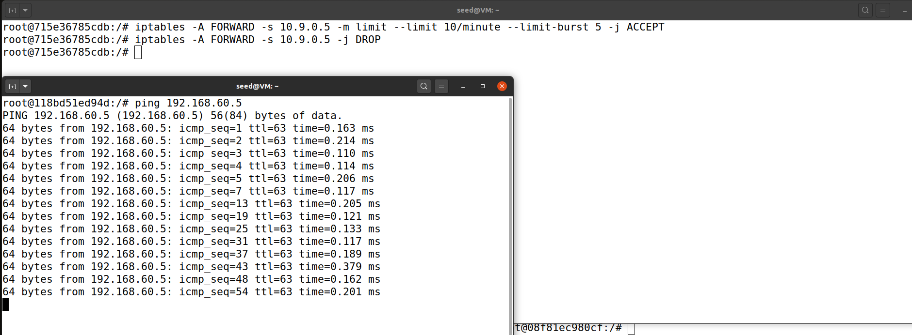

根据 `icmp_seq` 不连续可以看出，很大一批数据包被 DROP，这是由于设置的丢弃所有剩余包。

如果不设置，数据包 DROP 或是 ACCEPT 取决于默认策略。

## Task5-负载均衡

使用 iptables 对内部网络中的三个 UDP 服务器进行负载均衡。

在 `192.168.60.5`、`192.168.60.6`、`192.168.60.7` 中：

```bash
# -k 允许服务器接收来自多个主机的 UDP 报文段
nc -luk 8080
```

在 `10.9.0.5` 中：

```bash
echo hello | nc -u 10.9.0.11 8080
```

使用 `statistic` 模块来实现负载均衡，有 random 和 nth 两种模式。

1. **nth 轮询模式**

   发到路由器的所有 UDP 数据包都被轮询发给三个内部计算机：

   ```bash
   iptables -t nat -A PREROUTING -p udp --dport 8080 -m statistic --mode nth --every 3 --packet 0 -j DNAT --to-destination 192.168.60.5:8080

   iptables -t nat -A PREROUTING -p udp --dport 8080 -m statistic --mode nth --every 2 --packet 0 -j DNAT --to-destination 192.168.60.6:8080

   iptables -t nat -A PREROUTING -p udp --dport 8080 -m statistic --mode nth --every 1 --packet 0 -j DNAT --to-destination 192.168.60.7:8080

   # ------------
   # 清空规则表
   iptables -t nat -F
   ```

   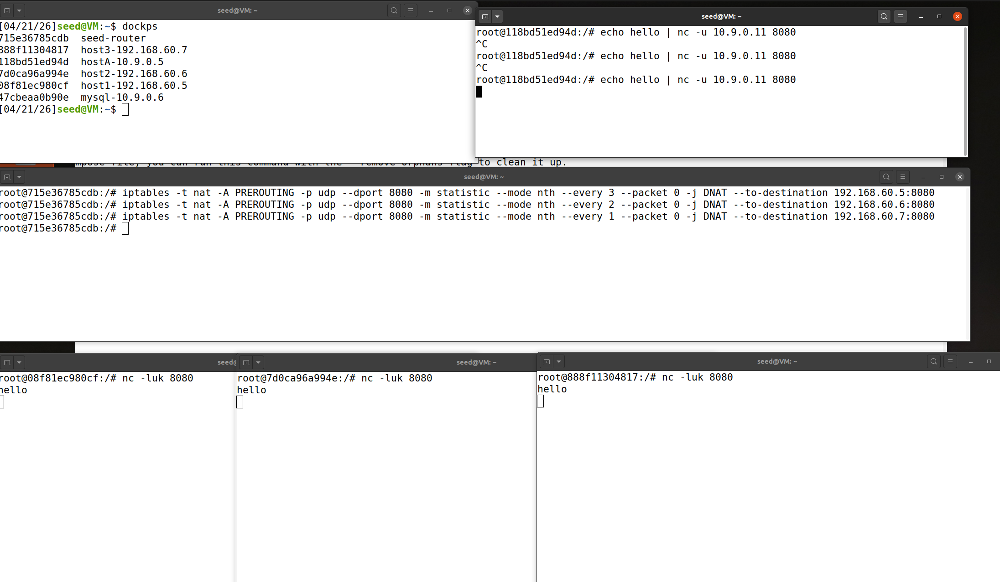

2. **random 模式**

   ```bash
   # 以 1/3 的概率转发到 192.168.60.5
   iptables -t nat -A PREROUTING -p udp --dport 8080 -m statistic --mode random --probability 0.3333 -j DNAT --to-destination 192.168.60.5:8080

   # 在规则1未命中的包中，再以 1/2 的概率转发到 192.168.60.6
   iptables -t nat -A PREROUTING -p udp --dport 8080 -m statistic --mode random --probability 0.5 -j DNAT --to-destination 192.168.60.6:8080

   # 所有剩余未匹配的包（即既不是1/3，也不是剩下2/3中的1/2）转发到 192.168.60.7
   iptables -t nat -A PREROUTING -p udp --dport 8080 -j DNAT --to-destination 192.168.60.7:8080

   # ------------
   # 清空规则表
   iptables -t nat -F
   ```

   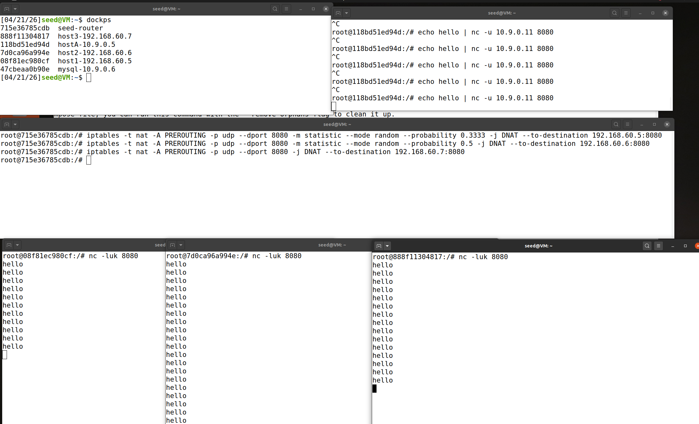

结果按概率分配。

## 总结

本实验全面学习了防火墙的工作原理和实现：

- **Netfilter**：Linux 内核中的包过滤框架，提供 5 个钩子点（PRE_ROUTING、LOCAL_IN、FORWARD、LOCAL_OUT、POST_ROUTING）
- **Linux 内核模块（LKM）**：可以动态加载和卸载的内核代码，无需重新编译内核
- **无状态防火墙**：对每个数据包独立判断，不维护连接状态
- **iptables**：用户空间工具，用于配置基于 Netfilter 的防火墙规则
- **有状态防火墙**：通过 `conntrack` 模块跟踪连接状态，能够识别数据包是否属于已建立的连接
- **连接超时**：ICMP 和 UDP 保持 30 秒，TCP 保持 5 天（TIME_WAIT 状态保持 120 秒）
- **流量限制**：使用 `limit` 模块限制数据包速率
- **负载均衡**：使用 `statistic` 模块的 nth（轮询）或 random（随机）模式实现流量分发

相比无状态防火墙，有状态防火墙在配置上更加简洁，只需要设置允许建立哪些连接，然后允许属于已建立连接的数据包通过即可。

